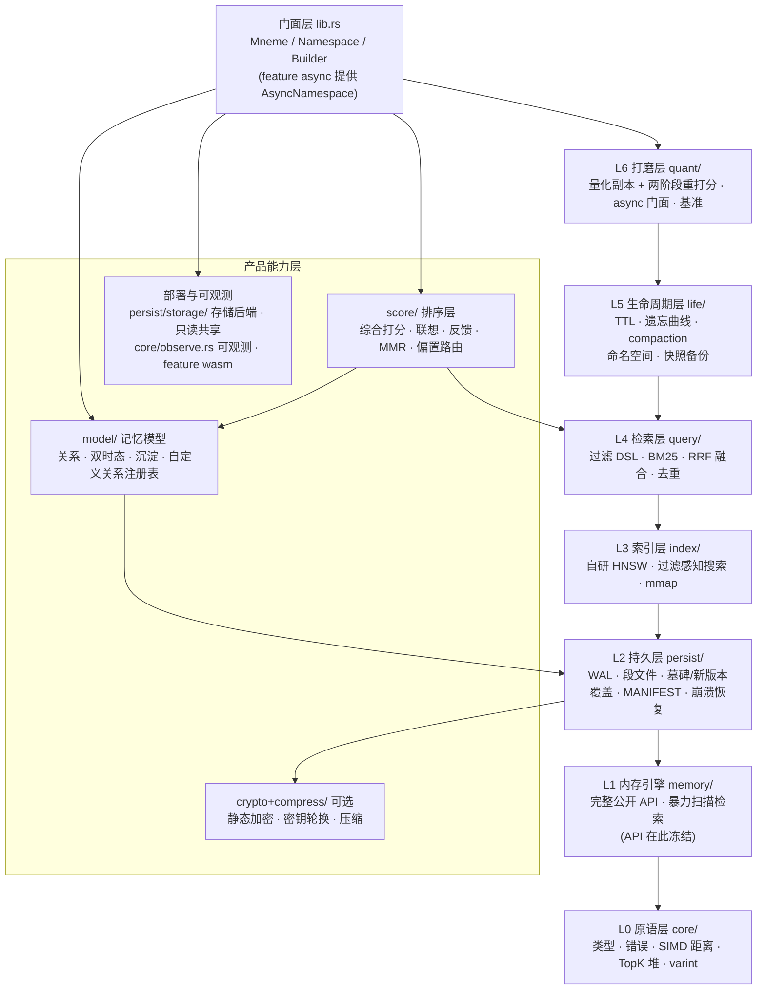

# Mneme 设计文档

> **Mneme**(μνήμη,古希腊语"记忆";记忆女神 Mnemosyne 的同源词)是一个纯 Rust 编写的**嵌入型向量存储引擎**,
> 专为 **AI Agent 的超长期记忆层**设计:进程内运行、无需服务端、数据经年累月增长而不失控。

- 许可:The Unlicense(公共领域)

---

## 一句话定位

**把"给 Agent 装一个不会失忆、也不会记忆膨胀的大脑"做成一个 `cargo add mneme-db` 就能用的库。**

如果你完全不了解 RAG、嵌入向量、近似检索这些概念,请从 [00-fundamentals.md](design/00-fundamentals.md) 开始——
它假设读者只懂得基础编程,不假设任何 AI/数据库背景。

---

## 分层地图

Mneme 采用**渐进式分层设计**:自底向上共 7 层(L0–L6),每层只依赖下层,
**每层都是可独立交付使用的完整产品**。层边界即稳定接口,上层替换实现不破坏 API。

| 层 | 可用形态 | 详细设计 |
|---|---|---|
| L0 原语 | 无 I/O 的数学/类型库 | [02-l0-core.md](design/02-l0-core.md) |
| L1 内存引擎 | 纯内存向量库(易失),公开 API 冻结 | [03-l1-memory.md](design/03-l1-memory.md) |
| L2 持久层 | 重启不丢数据,可崩溃恢复(含跨段覆盖持久化) | [04-l2-persist.md](design/04-l2-persist.md) |
| L3 索引层 | 同一 API 下暴力→HNSW 无感升级 | [05-l3-hnsw.md](design/05-l3-hnsw.md) |
| L4 检索层 | 过滤 + BM25 混合检索 + 去重 | [06-l4-query.md](design/06-l4-query.md) |
| L5 生命周期 | "超长期"闭环:段数有界、安全遗忘 | [07-l5-life.md](design/07-l5-life.md) |
| L6 打磨 | 量化提速(i8/f16 + 两阶段)、async 门面 | [08-l6-quant.md](design/08-l6-quant.md) |
| 记忆模型 | 关系图、双时态 `as_of`(历史默认永久保留)、来源/可信度、沉淀 | [09-memory-model.md](design/09-memory-model.md) |
| 排序层 | 相似度+新鲜度+重要度+访问+可信度+联想 | [10-scoring.md](design/10-scoring.md) |
| 存储安全 | 可选静态加密、文本压缩 | [11-security-storage.md](design/11-security-storage.md) |
| 部署形态 | 多进程只读、WASM 适配、可观测钩子 | [12-deployment.md](design/12-deployment.md) |

---

## 文档目录

> 下表按**建议阅读顺序**排列:先背景与总览,再核心分层 L0–L6,然后是横切的产品能力层,
> 最后是验收与参考。章节编号是稳定的主题标识(09–12 为产品能力层、13 为记忆模式手册、14–16 为验收与参考),
> 因此编号不严格等于阅读次序;mdBook 侧栏顺序以 [SUMMARY.md](SUMMARY.md) 为准。

| 文件 | 内容 | 读者 |
|---|---|---|
| [00-fundamentals.md](design/00-fundamentals.md) | **零基础篇**:嵌入向量、相似度、ANN、WAL/MVCC 等所有前置概念,零 AI/数据库背景可读 | 所有人 |
| [01-overview.md](design/01-overview.md) | 项目定位、设计目标、总体架构、依赖白名单、公开 API 清单 | 所有人 |
| [guide.md](guide.md) | **开发者指南**:面向使用方,从引入依赖、建模、集成到上生产的完整路径与排障清单 | 使用者/集成者 |
| [02-l0-core.md](design/02-l0-core.md) | 原语层:距离度量的数学、SIMD、TopK 堆、varint | 贡献者/学习者 |
| [03-l1-memory.md](design/03-l1-memory.md) | 内存引擎、暴力检索、过滤 AST、公开 API 冻结 | 贡献者 |
| [04-l2-persist.md](design/04-l2-persist.md) | 文件字节级布局、WAL/CRC/崩溃恢复、MANIFEST 原子性、Bloom/zone map | 贡献者 |
| [05-l3-hnsw.md](design/05-l3-hnsw.md) | **HNSW 完整数学**:层级分布推导、构建/搜索算法、复杂度、过滤三档策略 | 贡献者/学习者 |
| [06-l4-query.md](design/06-l4-query.md) | DSL 文法、BM25 公式逐项拆解、RRF 融合、去重、执行管线 | 贡献者 |
| [07-l5-life.md](design/07-l5-life.md) | 指数遗忘曲线、size-tiered compaction 写放大分析、快照备份 | 贡献者 |
| [08-l6-quant.md](design/08-l6-quant.md) | i8/f16 量化误差分析、两阶段检索、async 门面 | 贡献者 |
| [09-memory-model.md](design/09-memory-model.md) | **记忆模型**:关系图、双时态 `as_of`、来源/可信度、记忆沉淀 | 贡献者 |
| [10-scoring.md](design/10-scoring.md) | **记忆感知排序**:综合打分、联想扩展、反馈闭环、MMR | 贡献者 |
| [11-security-storage.md](design/11-security-storage.md) | 可选静态加密(AEAD)与文本/元数据压缩 | 贡献者/运维 |
| [12-deployment.md](design/12-deployment.md) | 多进程只读、`Storage` 抽象与 WASM、可观测钩子 | 贡献者/运维 |
| [13-cookbook.md](design/13-cookbook.md) | Agent 记忆模式配方(可直接照抄) | 使用者 |
| [14-testing.md](design/14-testing.md) | 崩溃注入方法论、召回属性测试、基准目标、fuzz | 贡献者 |
| [15-glossary.md](design/15-glossary.md) | 术语表(中英对照)、符号表、复杂度速查总表 | 所有人 |
| [16-api-reference.md](design/16-api-reference.md) | 完整公开 API、配置总表、打开校验、错误/重试、线程安全、集成、备份恢复 runbook、数据限额 | 所有人 |
| [spec/contracts.md](spec/contracts.md) | 形式化契约矩阵(FC-Matrix)与测试追溯 | 贡献者 |
| [rust/README.md](rust/README.md) | **Rust 零基础教学**(11 章):以 mneme 源码为教材,覆盖读懂 L0–L6 各层引入的 Rust 语法 | 无 Rust 基础者 |

---

## 阅读路线

**我完全没写过 Rust**(零基础,约 7–11 小时):
先读 [Rust 零基础教学](rust/README.md) 的 11 章(以 `src/core/` 与各层源码为教材,边读边敲),
再回到这里按"贡献者"路线阅读。教学文档与源码的映射总表见
[rust/README.md §4](rust/README.md)。

**我只想用这个库**(使用者,约 30 分钟):
[开发者指南](guide.md)(从安装到上线的完整路径)→
[00 基础篇 §1–§3](design/00-fundamentals.md) → [01 总览的 API 清单](design/01-overview.md) →
[13 记忆模式手册](design/13-cookbook.md)(照抄配方)→
[16 API 与运维参考](design/16-api-reference.md)(配置/错误/备份按需查)。
需要记忆关系/双时态/排序时再看 [09](design/09-memory-model.md)/[10](design/10-scoring.md)。
设计文档其余部分可以在遇到问题(比如"为什么重启后我的查询变快了")时按需查阅。

**我想理解它为什么这样设计**(学习者,约 3–4 小时):
[00 基础篇](design/00-fundamentals.md) → [01 总览](design/01-overview.md) →
[05 HNSW 数学](design/05-l3-hnsw.md) → [04 持久层](design/04-l2-persist.md) →
[06 检索层](design/06-l4-query.md) → [07 生命周期](design/07-l5-life.md)。
HNSW 与 BM25 两章是全书数学最密集的部分,但每一步推导都不跳步。

**我要参与开发**(贡献者):
按层序通读 02–08 各章(从 [02 原语层](design/02-l0-core.md) 开始),重点掌握每章末尾的
"层边界契约"小节(定义了本层向上暴露、向下依赖的精确接口);再读产品能力层
[09 记忆模型](design/09-memory-model.md)/[10 排序](design/10-scoring.md)/
[11 安全存储](design/11-security-storage.md)/[12 部署](design/12-deployment.md),
最后读 [14 测试](design/14-testing.md) 与 [spec/contracts.md](spec/contracts.md)
了解验收标准与形式化契约(FSVDD 强制)。

---

## 文档约定

1. **四段式讲解**:每个关键算法按以下四要素展开(顺序可按内容调整,【工程】为可选补充段)——
   - **【直觉】** 生活化类比,先弄懂它解决什么问题;
   - **【数学】** 完整公式推导(KaTeX 渲染),符号逐一解释,不跳步;
   - **【复杂度】** 时间/空间复杂度表,含推导过程;标注"经验值"的结论无严格证明;
   - **【算例】** 小规模数字实例手算走一遍(4 维向量、8 个点的图、2 篇文档……)。
   实现取舍、SIMD/存储/性能等工程细节以 **【工程】** 作为可选补充段。
2. **公式渲染**:所有公式统一用 KaTeX 书写,由 mdbook-katex 预处理器在构建时渲染。
3. **术语中英对照**:术语首次出现给出英文原文与一句话定义,如
   "近似最近邻检索(ANN, Approximate Nearest Neighbor):不求绝对最近、只求大概率最近的检索策略"。
   完整表见 [15-glossary.md](design/15-glossary.md)。
4. **图表**:架构/流程用 Mermaid(本站原生渲染);文件字节布局用 ASCII 图(与渲染器无关)。
5. **复杂度符号**:一律使用大 O 记号,定义见 [00 基础篇 §7](design/00-fundamentals.md)。
6. **工程参数**:所有数值参数(如 `M=16`、计算分块 8192)均为**默认值**,
   以配置项暴露(常用项见 `Builder`,细粒度调参请见 `Tuning`),文档中标注为"默认";
   与磁盘格式绑定的常量(如存储/索引块粒度 1024)固定不可配;完整配置面见 [16 §2](design/16-api-reference.md)。
7. **不变量编号**:跨层契约用 `I1–I30` 编号(定义散见 02/03/04/06/07/08/09/10/11/12 与
   [16 §9](design/16-api-reference.md),汇总映射见 [14 §1.1](design/14-testing.md)),
   测试代码必须引用编号;每条不变量在 [spec/contracts.md](spec/contracts.md) 有对应
   `FC-*` 契约条目,由 `tests/contract_traceability.rs` 在 `cargo test` 中校验双向追溯(FSVDD 强制)。
8. **站点构建**:文档用 mdBook 组织(`book.toml` + [SUMMARY.md](SUMMARY.md)),
   KaTeX/Mermaid 由预处理器渲染;本地预览见仓库根目录的 `README.md`。
9. **阅读时长**:各章不强制标注预计阅读;仅 [00 零基础篇](design/00-fundamentals.md) 给出参考
   (40–60 分钟),其余按自身密度自行安排。四段式【直觉】【数学】【复杂度】【算例】可按需跳读。
