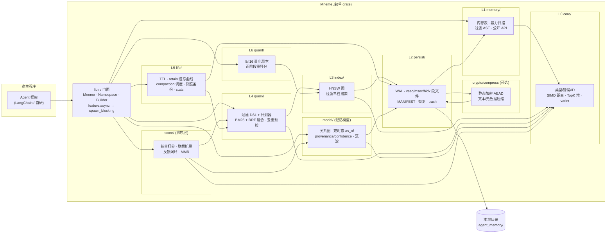

# 01 总览:定位、架构与分层

> **本章目标**:建立对 Mneme 的整体认知——它做什么、不做什么、由什么组成、按什么顺序建造。
> **前置阅读**:[00 零基础篇](00-fundamentals.md)(至少 §1–§5)。
> **本章你将学到**:设计目标表 → 总体架构 → L0–L6 渐进式分层 → 依赖白名单 → 公开 API 清单。

---

## 1. 定位

Mneme 是一个**纯 Rust 的进程内嵌入型向量存储库**,面向 **AI Agent 的超长期记忆层**:

- **嵌入型**:像 SQLite 一样作为库链接进宿主程序,数据就是本地一个目录,无服务、无网络、零运维;
- **Agent 记忆特化**:命名空间隔离、TTL/重要性/遗忘曲线、去重合并、混合检索都是引擎级一等公民,
  而不是应用层 hack;
- **超长期**:目标是"一个 Agent 用十年"——数据量增长段数有界、冷数据自动沉磁盘、
  内存占用有上界、老数据格式可演化。

### 1.1 设计目标

| 目标 | 量化标准 | 兑现章节 |
|---|---|---|
| 嵌入型零运维 | 单进程独占(文件锁);`cargo add mneme` 即用 | [01](01-overview.md) |
| 超长期不失控 | 活跃段数 O(log N) 有界;1M 条冷启动打开 < 1s;RSS 有上界 | [07](07-l5-life.md) |
| 高召回低延迟 | 1M×1536 维 P99 查询 < 10ms(量化后),Recall@10 ≥ 0.95 | [05](05-l3-hnsw.md) + [08](08-l6-quant.md) |
| 吞吐 | 批量插入 ≥ 50k 向量/秒 | [14](14-testing.md) |
| 崩溃安全 | 任意时刻掉电:已确认写入不丢、不出现半写数据、删除不复活 | [04](04-l2-persist.md) + [14](14-testing.md) |
| **记忆模型** | 关系图、双时态 `as_of`(历史版本默认永久保留,可配保留期)、来源/可信度、记忆沉淀均为引擎级能力 | [09](09-memory-model.md) |
| **记忆感知排序** | 相似度 + 新鲜度 + 重要度 + 访问 + 可信度 + 联想可配置参与排序 | [10](10-scoring.md) |
| **存储安全** | 可选静态加密(AEAD)与文本/元数据压缩 | [11](11-security-storage.md) |
| **部署形态** | 多进程只读共享;`Storage` 抽象支持 WASM 适配 | [12](12-deployment.md) |
| 最小依赖 | 非 feature 强依赖 4 个小 crate;默认开启 `mmap` 时共 5 个,多出的 1 个(`memmap2`)可经 feature 关闭;复杂算法全部自研;加密/压缩均为可选 feature | [01 §5](01-overview.md) |

### 1.2 设计边界

**明确不做**:

- 多进程并发**写**(单写者;多进程**只读**共享见 [12 §2](12-deployment.md));
- 分布式、副本、分片;
- 内置 embedding 推理(Mneme 只存向量,嵌入由宿主调用外部模型产生);
- SQL 或查询语言完整实现(只有记忆检索所需的过滤 DSL);
- 多租户鉴权:安全边界仍是宿主进程的文件系统权限;密钥由宿主经 `KeyProvider` 提供,
  引擎不内置密钥管理。

**可选能力**(默认关闭,不扩大依赖白名单):

- **静态加密**:可选 feature `encrypt`,AES-256-GCM 页级加密([11 §2](11-security-storage.md));
- **文本/元数据压缩**:可选 feature `compress`,内置 LZ4 风格 codec([11 §3](11-security-storage.md));
- **多进程只读共享**:`read_only(true)`([12 §2](12-deployment.md))。

---

## 2. 总体架构



> 上图只画主要调用/依赖边;各层均直接依赖 L0 `core`(为简洁略去部分重复连线)。

数据流与"一次查询的全流程"见 [00 §8](00-fundamentals.md)。

### 2.1 并发模型(全局决策)

- **单写者多读者**:写路径全局串行(一个 `Mutex`),读路径通过
  `RwLock<Arc<ReaderView>>` 拿到不可变的"段列表 + 可变表快照"视图后**无锁读**;
- **MVCC**:全局 seqno + 水位实现快照读(原理见 [00 §6.6](00-fundamentals.md));
- **同步核心 + async 门面**:核心库零 tokio 依赖;`feature = "async"` 提供的
  async API 全部是 `spawn_blocking` 薄包装([08 §6](08-l6-quant.md));
- **线程安全**:`Mneme`/`Namespace`/`SnapshotHandle` 均为 `Send + Sync`,可跨线程共享;
  完整保证见 [16 §5](16-api-reference.md)。

---

## 3. 渐进式分层(建造顺序)

每一层只依赖下层;**每层完成时都是一个可交付的完整产品**;层边界 = 稳定接口。

| 层 | 目录 | 内容 | 完成后的可用形态 | 验收(详见 [14](14-testing.md)) |
|---|---|---|---|---|
| L0 | `core/` | 类型/错误/ID、SIMD 距离、TopK 堆、varint | 无 I/O 数学库 | 距离函数对照测试 |
| L1 | `memory/` | 全内存引擎、暴力扫描、过滤 AST、去重预检 | **纯内存向量库**(易失,可用于测试/缓存);**公开 API 在此冻结** | 全 API 集成测试 |
| L2 | `persist/` | WAL、vsec/msec 段、MANIFEST、恢复、墓碑删除 | 重启不丢数据;WAL 超限自动全量快照兜底 | 崩溃注入测试全绿 |
| L3 | `index/` | 自研 HNSW、hidx 持久化、过滤三档搜索 | 同一 API 下暴力→ANN 无感升级;mmap 引入(可关) | Recall@10 ≥ 0.95 |
| L4 | `query/` | 过滤 DSL 解析、zone map 下推、BM25+RRF、去重 | 混合检索可用 | 混合检索集成测试 |
| L5 | `life/` | TTL、遗忘曲线、size-tiered compaction、命名空间、快照/备份、stats | **超长期闭环**:段数有界、安全遗忘 | 24h 长跑测试 |
| L6 | `quant/` | i8/f16 量化+重打分、async 门面完善、基准、fuzz | 达到全部性能目标 | 基准达标 |

> **产品能力层(09–12)** 不改变 L0–L6 的建造顺序,而是横切其上:
> 记忆模型/排序在 L1 冻结的 API 上追加类型与语义([09](09-memory-model.md)/[10](10-scoring.md)),
> 安全存储复用 L2 布局([11](11-security-storage.md)),部署形态复用 write-once 语义
> ([12](12-deployment.md))。它们默认关闭,开启不改变默认行为。

**渐进式的两个关键手段**:

1. **接口先于实现**:公开 API 在 L1 冻结(暴力与 HNSW 同签名),L3 **引入内部 trait
   `VectorStore`** 作为暴力→HNSW 的替换缝;L2 的段文件头从第一天就带 `format_version` 字段。
   (L1/L2 直接在引擎内实现公开语义,不下沉该内部 trait;见 [03 §8](03-l1-memory.md)。)
2. **每层有兜底**:L2 阶段(还没有 compaction)用"WAL 总量超 256MB 自动全量快照兜底"([04 §3.2](04-l2-persist.md));
   L3 永远保留暴力扫描作为过滤极端选择性时的第三档策略。
   系统在每一层都是"完整能跑"的,性能和功能是逐层叠加的。

---

## 4. 单 crate 模块布局

**决定:单 crate 起步,不做 workspace。** L0–L6 之间只允许向下依赖(L 序号大的依赖小的);
产品能力层(09–12 的 `model/`、`score/`、`crypto/`、`compress/`、`deploy/`、`obs/`)可在其
**内部**相互依赖(如 `score → model`),但不得反向依赖门面或上层。`core` 之外禁止跨层
反向穿透。若未来某边界确需独立发布,再按现成模块边界拆分(不在承诺内)。

```text
mneme/
├── src/
│   ├── lib.rs          # 门面:Mneme / Namespace / Builder;pub use 公开类型
│   ├── core/           # L0:types.rs error.rs metric.rs simd.rs varint.rs meta.rs heap.rs options/
│   ├── memory/         # L1:engine.rs engine_ops.rs builder.rs namespace/ snapshot.rs snapshot_scan.rs search_builder.rs search_exec.rs expand.rs rerank.rs table.rs bitset.rs search.rs pred.rs pred_eval.rs record.rs write_helpers.rs mutate_helpers.rs dedup.rs relation.rs temporal.rs score.rs lifecycle.rs ops.rs config.rs
│   ├── persist/        # L2:wal.rs vsec.rs msec.rs delta.rs edges.rs manifest.rs recover.rs flush.rs source.rs storage.rs trash.rs
│   ├── index/          # L3:hnsw.rs graph.rs filtered.rs merge.rs rebuild.rs
│   ├── query/          # L4:parse.rs plan.rs zmap.rs bm25.rs fusion.rs result_dedup.rs exec.rs
│   ├── life/           # L5:ttl.rs retain.rs access.rs namespace.rs compact.rs backup.rs stats.rs
│   ├── quant/          # L6:scalar_i8.rs f16.rs rescore.rs
│   ├── model/          # 记忆模型:relation.rs temporal.rs provenance.rs consolidate.rs   (09)
│   ├── score/          # 排序层:formula.rs expand.rs feedback.rs diversify.rs           (10)
│   ├── crypto/         # feature encrypt:aead.rs keyring.rs                              (11)
│   ├── compress/       # feature compress:codec.rs lz4.rs                                (11)
│   ├── deploy/         # readonly.rs                                                    (12)
│   └── obs/            # observer.rs                                                      (12)
├── benches/            # criterion 基准(L3 起)
├── fuzz/               # cargo-fuzz 目标(L6 起)
├── tests/              # 契约验收 + contract_traceability.rs 追溯门禁
├── docs/               # 本文档
│   └── spec/           # FC-Matrix 形式化契约
└── Cargo.toml
```

---

## 5. 依赖白名单

**原则:std 优先,复杂能力一律自研。** 外部依赖只允许"小、稳、无传递依赖(或传递极少)"的
基础设施件;新增任何依赖必须在 PR 中论证。复杂算法(HNSW、BM25、量化、bloom、
compaction 调度、分词)**全部自研**。

| 依赖 | 用途 | 进入层级 | 隔离措施 |
|---|---|---|---|
| `thiserror` | 错误派生宏 | L0 | 仅宏便利,可随时手写替换 |
| `serde` + `serde_json` | 元数据 Value、DSL 序列化 | L0 | **只允许** `core/meta.rs` 接触,外部只见 `Meta` 别名 |
| `crc32fast` | CRC-32 校验 | L2 | 传递极少(仅 `cfg-if`) |
| `memmap2` | mmap 零拷贝读 | L3 起 | feature `mmap`(默认开);关闭走 `Read+Seek` 兜底 |
| `half` | f16 转换 | L6 | feature `quant-f16` |
| `tokio` | async 门面 | 门面 | feature `async`(默认关);核心零 tokio |
| `aes-gcm` | 静态加密 AEAD | L2 | feature `encrypt`(默认关);仅 `crypto/` 接触 |
| `zstd` | 可选更强压缩 | L2 | feature `compress-zstd`(默认关);内置 LZ4 风格 codec 无依赖 |

> **默认构建口径**:`thiserror` + `serde` + `serde_json` + `crc32fast` = 4 个**直接**强依赖
> (`serde_json` 另带入 `itoa`/`ryu`/`memchr` 等极少数传递依赖);
> `mmap` 默认开启会额外引入 `memmap2`,故**默认构建实为 5 个**。`memmap2`/`half`/`tokio`
> 都随 feature 走,`--no-default-features` 可回到 4 个。
>
> **元数据构造**:`Meta` 即 `serde_json::Value`,库重导出 `json!` 宏(`use mneme::json;`),
> 宿主无需直接依赖 `serde_json`;除此之外不暴露任何 serde_json 类型。

**明确不引入**(自研替代):`rayon`(用 `std::thread::scope`)、`crossbeam`(用
`std::sync::mpsc`)、`parking_lot`/`arc-swap`(用 std `RwLock`/`Mutex`)、
`zerocopy`(手写编解码)、`xxhash`(crc32 足够)、`unicode-segmentation`
(手写分词:空白切词 + CJK bigram)、任何现成 HNSW/BM25 库。

dev-dependencies(不进入发布产物):`proptest`、`tempfile`、`criterion`。

### 5.1 Feature 总表

| feature | 默认 | 引入 | 说明 |
|---|---|---|---|
| `mmap` | ✅ 开 | `memmap2` | 关闭后段文件走 `FileSource`(`Read + Seek`),功能不变、稍慢 |
| `async` | ❌ 关 | `tokio` | 提供 `insert().await` 等 async API |
| `quant-f16` | ❌ 关 | `half` | 提供 f16 量化副本;关闭时只有 f32/i8 |
| `encrypt` | ❌ 关 | `aes-gcm` | 静态加密([11 §2](11-security-storage.md)) |
| `compress` | ❌ 关 | 无 | 内置 LZ4 风格压缩([11 §3](11-security-storage.md)) |
| `compress-zstd` | ❌ 关 | `zstd` | 可选更强压缩 |
| `wasm` | ❌ 关 | 无 | 关闭 mmap/线程并行,WASM 适配([12 §3](12-deployment.md)) |

---

## 6. 公开 API(在 L1 冻结)

以下类型与方法的**签名在 L1 完成时冻结**,后续层只升级实现。完整语义见
[03 章](03-l1-memory.md),此处为速览。

```rust
// ---- 构建 / 打开 ----
let db = Mneme::builder()
    .path("./agent_memory")              // 省略则 = 纯内存(须用 .dimension(d) 或 in_memory(d))
    .dimension(1536)                     // 新建必填;打开时校验,建库后不可改
    .metric(Metric::Cosine)              // 默认 Cosine
    .fsync(FsyncPolicy::Batched(Duration::from_millis(20)))
    .insert_mode(InsertMode::Upsert)     // 同 key 行为
    .dedup(Dedup::Off)                   // 去重策略
    .build()?;                           // -> Result<Mneme>
// let db = Mneme::open("./agent_memory")?;  // 打开已有库:维度/度量从 MANIFEST 读回

let ns = db.namespace("agent-42/session-88");   // 分层命名空间

// ---- 写入 ----
let outcome = ns.insert(
    Record::new(vector)                          // 维度在 insert 时校验,故无 Result
        .key("mem_001")                          // 外部键,可选;重复即 upsert
        .text("用户偏好深色模式")                  // 可选;启用 BM25 与文本去重
        .metadata(json!({"kind":"preference"}))   // 可选 JSON;importance 用 .importance() 设
        .importance(0.8)                          // 可选;默认 0.5
        .ttl(Duration::from_secs(30 * 86400))    // 可选;到期自动遗忘
)?;   // -> InsertOutcome { Inserted(RowId) | Merged(RowId) | Duplicate{..} }(去重开启时)

let outcomes = ns.insert_batch(batch)?;          // 批量原子写入(50k/s 目标的公开入口)
ns.update("mem_001", UpdatePatch::new().text(Some("用户偏好深色模式".into())))?;  // 保留 RowId 的局部更新

// ---- 检索(向量 + 过滤 + 记忆感知排序) ----
let hits: Vec<Hit> = ns.search().vector(&q)
    .top_k(10).ef(128)
    .filter(filter!(r#"kind == "preference" && importance > 0.5"#))
    .score(Scoring::new().w_recency(0.2).w_importance(0.3))   // 见 10
    .diversify(Diversity::Mmr { lambda: 0.7 })
    .execute()?;

// ---- 混合检索(向量 + 关键词,RRF 融合 + 联想扩展) ----
let hits = ns.search().vector(&q).text("深色模式")
    .fusion(Fusion::Rrf { k: 60 })
    .expand(RelationExpand { hops: 1, kinds: vec![RelationKind::SUPPORTS], decay: 0.5, max_nodes: 64 })
    .top_k(10).execute()?;

// ---- 单点读 / 批量读 / 删除 / 遍历 ----
let rec: Option<RecordRef<'_>> = ns.get("mem_001")?;
if let Some(r) = &rec { let _v = r.vector(); }    // 零拷贝;或 get_vector(rowid)
let many = ns.get_many(&["mem_001", "mem_002"])?; // 批量点读
let _exists = ns.exists("mem_001")?;
let _n = ns.count(Some(filter!("kind == \"scratch\"")))?; // 命中行数(不物化记录)
ns.delete("mem_001")?;            // 无 key 记录用 delete_by_rowid(rowid)
for row in ns.iter(Some(filter!("kind == \"scratch\"")))? { let rec = row?; /* ... */ }

// ---- 记忆模型(关系 / 双时态 / 沉淀) ----
ns.relate(a, b, RelationKind::SUPPORTS, 0.8)?;
ns.relate_with_options(
    a, b,
    RelateOptions::new(RelationKind::SUPPORTS, 0.8).metadata(json!({"reason":"user"})),
)?; // 带边元数据
let edges = ns.neighbors(a, &[RelationKind::SUPPORTS])?;          // 出边
let in_edges = ns.predecessors(b, &[RelationKind::SUPPORTS])?;    // 入边(开 relation_index(Both) 时更快)
ns.supersede("pref.theme", Record::new(vector))?; // 信念修订:要求同 key 已存在;旧版本 valid_to 闭合
let old = db.as_of(ts("2024-03-01"))?;            // 时间旅行读
let report = ns.consolidate(ConsolidationPolicy::default())?;
ns.feedback(hits[0].rowid, Feedback::Used, hits[0].query_id)?;  // 检索反馈闭环(query_id 幂等)

// ---- 记忆生命周期 ----
ns.touch("mem_001", None)?;                               // 记忆强化(访问计数+1;Some(d) 可提 importance)
ns.forget(filter!("kind == \"scratch\""))?;               // 主动遗忘
ns.retain(Retention::new()
    .half_life(Duration::from_secs(14 * 86400))           // 遗忘曲线半衰期
    .min_importance(0.2)
    .protect(filter!("kind == \"decision\"")))?;          // 白名单豁免

// ---- 命名空间 / 运维 ----
let names = db.list_namespaces()?;
db.drop_namespace("agent-42/session-88")?;                // 含子命名空间
let snap = db.snapshot();                                 // 钉住当前版本的只读句柄
let s = db.stats()?;        // 段数/行数/WAL 尺寸/延迟直方图/每 NS 统计
db.check()?;                // fsck:校验 CRC 与索引一致性
db.backup_to("./backup")?;  // 一致性快照备份
db.flush()?;                // 显式落盘(把可变表写成段)
db.close()?;                // flush + 释放文件锁;Drop 只尽力 flush
```

> 示例中的 `json!` / `filter!` 由库导出;`ts("2024-03-01")` 为 ISO 8601 → Unix 毫秒的示意辅助函数。

完整签名、配置总表、打开校验、错误/重试与备份 runbook 见
[16 公开 API 与运维参考](16-api-reference.md)。

公开类型速览(首次出现的 `Meta` / `QueryId` / `ConsolidationPolicy` 等,完整定义分别在
[02 §7](02-l0-core.md) / [10 §4](10-scoring.md) / [09 §5](09-memory-model.md)):

| 类型 | 说明 |
|---|---|
| `Record` | 一条记忆:可选 key、向量、可选 text、元数据(JSON)、可选 TTL、可选 importance |
| `Hit` | 检索命中:RowId(全局稳定)、key、score、记录视图(不含向量) |
| `RecordRef<'_>` | 存储记录只读视图(无 score),用于 `get`/`iter`;`vector()` 零拷贝取原始向量 |
| `InsertOutcome` | `Inserted(RowId)` / `Merged(RowId)`(去重合并)或 `Duplicate { existing: RowId, score }`(去重拒绝) |
| `Metric` | `Cosine / Dot / Euclidean` |
| `FsyncPolicy` | `Always / Batched(Duration) / OnFlush / Never` |
| `InsertMode` / `Dedup` / `ResultDedup` | 同 key 行为 / 写入期去重 / 结果级去重 |
| `Expr` / `CmpOp` / `Val` / `FieldBuilder` / `filter!` | 过滤 AST、取值与组合器,及字符串解析宏 |
| `Fusion` | `Rrf { k } / Weighted { alpha }` |
| `Retention` | 遗忘策略:半衰期、重要性下限、保护过滤器 |
| `UpdatePatch` / `UpdateOutcome` | 保留 RowId 的局部更新 |
| `Scoring` / `ScoreBreakdown` / `Diversity` / `RelationExpand` / `TimeAxis` | 综合打分及其因子分解 / MMR / 联想扩展 / 时间轴(见 10) |
| `RelationKind` / `RelationIndex` / `Edge` / `Feedback` / `QueryId` | 记忆关系、反向索引与检索反馈(见 09/10) |
| `ConsolidationPolicy` / `Summarizer` / `ConsolidateReport` | 记忆沉淀(见 09) |
| `Encryption` / `KeyProvider` / `Cipher` / `Compression` / `Codec` | 静态加密与压缩(见 11,可选 feature) |
| `Storage` / `Observer` / `Event` / `WriteOp` | 存储抽象与可观测(见 12) |
| `VectorFormat` | `F32 / F16 / I8Rescored`(L6 量化) |
| `HnswParams` / `CompactionPolicy` / `Tuning` / `Limits` | 索引 / 合并 / 进阶调参 / 数据限额配置 |
| `Clock` | 时间源注入(测试确定性) |
| `SnapshotHandle` | 钉住某 ReaderView(段集 + 可变表快照)的只读句柄;经 `namespace()` 取命名空间视图(时间旅行读) |
| `SnapshotNamespace` | 快照上的命名空间只读视图,提供 `search`/`get`/`iter` 等读取面 |
| `AsyncNamespace` | async 门面(feature `async`),共享同一底层句柄 |
| `Reranker` / `QueryCtx` | 精排回调钩子及其查询上下文 |
| `Stats` / `SegmentStat` / `NsStat` / `Histogram` / `QuantStat` / `StorageStat` / `HistoryStat` | 运行统计(段/WAL/延迟/每命名空间/量化/合并/存储安全/版本链) |
| `CheckReport` / `BackupReport` / `RetainReport` / `SnapshotStats` | 运维报告 |
| `CompactionState` / `CompactionControl` | 后台合并状态与 pause/resume 控制 |
| `AccessStat` | 单条记录的访问统计(`last_access_ms` / `access_count`) |
| `MnemeError` | 统一错误(见 [02 §2](02-l0-core.md)) |

---

## 7. 与同类方案的一句话对比

| 方案 | 形态 | 相对 Mneme 的差异 |
|---|---|---|
| Qdrant / Milvus | 服务端向量库 | 需独立部署与运维;过滤/量化思路可借鉴,Mneme 做成进程内 |
| LanceDB | 嵌入型,列式格式 | 通用数据湖导向;Mneme 更小而专:自研格式 + Agent 生命周期特性 |
| sqlite-vec | SQLite 扩展 | 借 SQLite 生态,暴力为主;Mneme 自带 HNSW 与记忆生命周期 |
| redb/fjall + 自拼索引 | 自组装 | 没有记忆语义(TTL/衰减/去重)与统一混合检索,需大量胶水层 |
| mem0 / Letta | 记忆编排框架 | 它们是 Mneme 的**典型客户**:编排层决定"记什么、忘什么",Mneme 提供引擎级支撑 |

**相对同类向量库的差异化能力**(其余是"更小更专"的工程取舍):

1. **记忆感知排序**:相似度 + 新鲜度 + 重要度 + 访问 + 可信度 + 联想可配置组合([10](10-scoring.md)),
   而不是只有余弦/BM25;
2. **记忆关系图**:记忆之间显式建边并支持联想扩展([09 §2](09-memory-model.md)),而非孤立向量;
3. **双时态**:`as_of(t)` 时间旅行读 + `supersede` 信念修订([09 §3](09-memory-model.md));
4. **记忆沉淀**:episodic→semantic 的聚类/摘要/溯源原语([09 §5](09-memory-model.md));
5. **反馈闭环**:检索结果可回写为记忆强化([10 §4](10-scoring.md));
6. **超长期闭环**:O(log N) 段数 + 遗忘曲线 + 安全默认([07](07-l5-life.md));
7. **可选存储安全与部署形态**:静态加密/压缩、多进程只读、WASM 适配([11](11-security-storage.md)/[12](12-deployment.md))。

---

## 本章小结

- 定位:进程内、嵌入型、**Agent 记忆特化**、超长期;明确不做多进程写/分布式/内置 embedding/SQL。
- 架构:7 层 L0–L6 只向下依赖,每层都是可交付产品;09–12 是横切其上的产品能力层。
- 依赖白名单 4 个强依赖(默认开 `mmap` 共 5 个),复杂算法全部自研,加密/压缩为可选 feature。
- 公开 API 在 L1 冻结;并发模型 = 单写者多读者 + MVCC 水位 + async 薄包装。
- 差异化能力:记忆感知排序、关系图、双时态、沉淀、反馈闭环、超长期闭环。

## 下一章

[02-l0-core.md](02-l0-core.md):从最底层开始——距离度量的数学、SIMD、TopK 堆与 varint。
