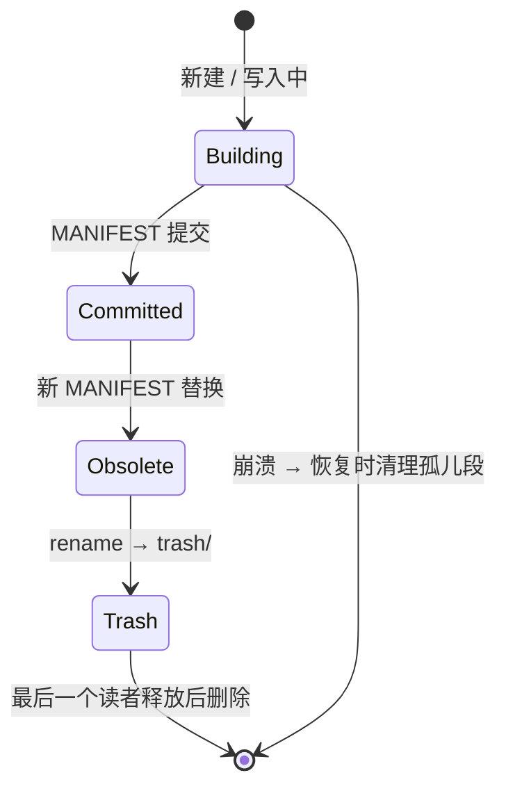

# 04 L2 持久层:WAL、段文件与崩溃恢复

> **本章目标**:让"重启不丢数据"成立:定义全部文件格式的**字节级布局**,
> 讲透 WAL 提交/回放、CRC 撕裂写检测、MANIFEST 原子替换与恢复流程。
> **前置阅读**:[00 §6](00-fundamentals.md)(WAL/CRC/MVCC/mmap 科普)、[03](03-l1-memory.md)。
> **本章你将学到**:目录与文件布局 → 四种文件的字节图 → WAL 协议 → CRC 数学 →
> zone map 与 Bloom filter 完整推导 → MANIFEST 原子性(Windows 专项) → 恢复流程。

模块:`persist/{wal/, vsec/, msec/, edges.rs, manifest/, recover/, flush/, source/, storage/, trash.rs, store/}`
(`store/` 是协调句柄 `Store`:实现内存引擎的 `PersistHook`、承接 `open`/`flush`/Checkpoint;
`delta` 数据区承载访问/关系变更条目,见 §2.2a)

---

## 1. 目录布局

```text
agent_memory/
├── current              # 指针文件:内容 = 当前 MANIFEST 版本号(如 "42")
├── MANIFEST.000041      # 旧版本 MANIFEST(write-once,保留最近 2 个)
├── MANIFEST.000042      # 当前版本 MANIFEST
├── wal/
│   └── wal_000001.log   # 预写日志(按字节上限多文件轮转,见 §3.2)
├── segments/
│   ├── seg_000007.vsec  # 向量段(vectors + norm + 删除位图)
│   ├── seg_000007.msec  # 元数据段(记录体 + 版本链表 + key 索引 + zone map + bloom + 倒排 + ns 统计)
│   └── seg_000007.hidx  # HNSW 图段(L3 起由 flush 写入,见 [05 §10](05-l3-hnsw.md))
└── trash/               # 待物理删除的文件(见 §9)
```

**段(segment)** 是不可变文件三元组:`(vsec, msec[, hidx])` 共享同一 `SegmentId`。
"不可变"是整个存储设计的锚点:只追加新段、只改 MANIFEST 指针,
读路径因此只需短暂读锁换一次视图引用、扫描全程无锁(§8)。可变性只有两个例外:
WAL 之后未落盘的内存可变表、后台 compaction 的重写。

---

## 2. 文件字节布局

约定:整数**小端**(LE);变长字段自带长度前缀;每个文件头部与数据尾部各一个 CRC-32。
头内定长字段按 8 字节自然对齐摆放,便于 mmap 后零拷贝读取。

> **feature 可选项**:`encrypt` / `compress` 默认关闭,且**不改变文件头字段布局**
> (无扩展区)。加密以整文件/整帧信封封装(读取时透明解封装),压缩只改变 msec
> 记录体内变长字段(新增 `flags2` 字节),详见 [11](11-security-storage.md) 与 §2.5;
> 关闭时下述字节图逐字节成立。

> **可移植性**:文件格式固定小端。小端平台上 mmap 后可直接零拷贝读取;大端平台需
> 逐字段字节交换(或整体走 `FileSource` 解码路径),正确性不变,但不在性能承诺内。
> 跨架构迁移 = 复制目录即可,格式本身与架构无关。

### 2.1 vsec(向量段)

```text
偏移   字段                          大小
0      magic "VSC1"                  4
4      format_version                u16
6      header_len                    u16
8      dimension                     u32
12     metric                        u8     (0=Cosine 1=Dot 2=Euclidean)
13     quant                         u8     (0=F32;其余值 = 量化副本格式,见 08 §5)
14     norm_col                      u8     (1 = 附带 norm 列)
15     reserved                      u8
16     row_count                     u64
24     created_unix_ms               i64
32     header_crc32                  u32    (覆盖 [0,32))
36     padding to 64B
--- 数据区(每行定长,32B 对齐) --------------------------------------
       vec[0..count]: f32 × dim      (LE,补齐到 32B 对齐)
       norm[0..count]: f32 × count   (norm_col=1 时)
       qvec[0..count]: 量化副本(quant != 0 时;布局见下)
       del_bitmap: 每 1024 行一块,块内 16 个 u64 字(共 1024 bit;1 = 当前不可见:被遮蔽/删除)
--- 尾部 ------------------------------------------------------------
       payload_crc32                 u32    (覆盖整个数据区;可选懒校验)
```

- **32B 对齐**:[02 §4](02-l0-core.md) 的 AVX2 内核用 `loadu` 读取,**不要求** 32B 对齐,
  此处按 32B 摆放只是避免跨缓存行惩罚的优化(非正确性前提);`dim × 4` 不是 32 的倍数时
  每行补齐(pad 区不参与计算);
- **删除位图分块**:查询时按块取"该块是否全活"的单 bit 摘要,整块全活零位图读取;
- **量化副本区**(`quant != 0` 时追加在 norm 区之后、删除位图之前):i8 先写段级
  每维 `(v_min, v_max)` 交错表(`2d` 个 f32,LE),再写每行 `d` 字节码;f16 只有
  每行 `2d` 字节码。`quant` 字节语义 `0=F32 / 1=i8 / 2=f16`(未知值 → `Corrupted`)。
  f32 原向量**仍保留**在 `vec` 区供精排(两阶段检索,见
  [08 §2.4/§5](08-l6-quant.md))。因此开启量化后每行总存储 = f32 原向量 + 量化副本,
  副本只降低**查询带宽**,不缩减磁盘占用;
- 物理位置即 `SlotId = 块号 × 1024 + 块内偏移`,位图天然支持 O(1) 判定;
  全局记录标识 `RowId` 由 msec 的 version_table 给出(见 §2.2),用于 `get_by_rowid` 定位。

### 2.2 msec(元数据段)

```text
0      magic "MSC1"                  4
4      format_version                u16
6      header_len                    u16
8      row_count                     u64
16     field_dict_offset / field_dict_len    2×u64  → 字段字典(见下)
32     version_table_offset / version_table_len 2×u64 → 版本链数组(每 RowId 多版本,§5.5)
48     key_index_offset / key_index_len  2×u64 → (NsId, key)→RowId 索引(条目含 SlotId/seqno,§5.5)
64     inv_offset / inv_len          2×u64  → 倒排索引(词表/postings/doc_len,§5.4)
80     ns_stats_offset / ns_stats_len 2×u64 → 命名空间级统计(§5.6)
96     zmap_offset / zmap_len        2×u64  → zone maps(每字段)+ ttl_map(见数据区)
112    bloom_offset / bloom_len      2×u64  → bloom 组
128    delta_offset / delta_len      2×u64  → 跨段覆盖区(访问/关系变更,L5 起写入,§2.2a)
144    rel_offset / rel_len          2×u64  → 关系邻接索引(仅正向表,§2.2b)
160    header_crc32                  u32    (覆盖 [0,160))
164..192 padding                      (补齐到 64B 对齐;header_len = 192)
--- 数据区 ----------------------------------------------------------
       doc_region: 连续的记录体(变长,记录体格式见下;段内顺序即 SlotId 顺序)
       version_table: (RowId u64, seqno u64, tx_ms i64, SlotId u32, doc_offset u64)
                      按 (RowId, seqno) 排序 → 同一 RowId 的全部保留版本(版本链,§5.5);
                      当前可见版本 = 该 RowId 链尾未被墓碑遮蔽者
       key_index:  按 (NsId, key) 排序的 [(NsId u32, key len+bytes, RowId u64, SlotId u32, seqno u64, doc_offset u64)]
                   → get(key) O(log n) 定位本段最新版本(跨段再按 seqno 合并,§5.5)
       field_dict:  [(u16 field_id, u8 kind, len, name bytes)...]  上限 16 个索引字段(默认,见 §5.1)
       zone_maps:   每 1024 行一块 × 每个数值/时间索引字段: (f64 min, f64 max, u8 flags)
                    (flags = has_value | has_null;±∞ 表示"区间未知",放弃该块剪枝)
       ttl_map:     每 1024 行一块一个 min(expires_at)(无 TTL 行记 +∞)→ TTL 整块剪枝(§5.2);
                    紧接 zone_maps 之后存放,计入 zmap_len
       blooms:      当前为 `key` 字段一个 bloom(参数见 §5.3)
       inverted:    倒排索引 = term_dict + [u64 postings_total_len] + postings + doc 区
                    (编码与打分见 [06 §3.4](06-l4-query.md);无文本记录时为空)
       ns_stats:    每命名空间一行 (NsId u32, doc_count u64, total_doc_len u64)
                    → 段内块级剪枝用(§5.6);BM25 的 N/avgdl 需跨段全局聚合
       delta:       跨段覆盖区(§2.2a):访问/关系变更的持久化载体(L5 起写入);
                    墓碑/更新仍由 version_table 版本行承载
       relations:   关系邻接索引(§2.2b):按 (from RowId) 排序的边表,供联想检索
--- 尾部 ------------------------------------------------------------
       payload_crc32                 u32
```

> 定长头为 **192 B**(偏移 `0..160` 为字段区、`header_crc32` 在偏移 **160**、
> `164..192` 为对齐填充)。msec 包含 `doc_region`、`version_table`、`key_index`、
> `ns_stats`、正向 `relations`,以及 `field_dict`、`zmap`(含 `ttl_map`)、`bloom`、
> `inverted`(倒排)四区(布局与构建见 §5.1–§5.4);`delta` 区承载增量段中的
> 访问/关系变更(§2.2a)。

**记录体(entry)格式**(doc_region 内,长度前缀):

```text
[u32 total_len]
[u64 rowid][u64 seqno][u32 ns_id]  # rowid = 稳定逻辑标识(更新时不变,见 §2.3)
[u8 flags]  # bit0=有key bit1=有text bit2=有ttl bit3=有importance bit4=有access
            # bit5=有valid_time bit6=有confidence bit7=有provenance
[u8 flags2] # bit0/1/2 = text/meta/provenance 字段为压缩 blob(恒写;未压缩时恒 0)
            #            feature `compress`/`compress-zstd`,FORMAT_VERSION = 0x0006
[key: len+bytes(可选)]
[text: len+bytes(可选)]
[meta: u32 json_len + serde_json 字节]
[i64 created_at_ms][i64 expires_at_ms(可选)][f32 importance(可选)]
[i64 last_access_ms][u32 access_count](可选,bit4;缺省视为 0/0)
[i64 valid_from_ms][i64 valid_to_ms(可选)](可选,bit5;有效时间,见 [09 §3](09-memory-model.md))
[f32 confidence](可选,bit6;默认 1.0)
[provenance: u32 len + JSON 字节](可选,bit7;来源/派生链)
```

> **压缩字段**:`flags2` 对应位置位时,该变长字段为自描述压缩 blob
> `[u8 codec_id][u32 uncompressed_len][compressed]`;压缩无收益时存原文且对应位为 0
> (`Compression::None` 时所有位恒 0,字段布局与未压缩定义一致)。

> **RowId 是稳定逻辑标识,一个 RowId 可有多个物理版本(版本链)**:更新/upsert 时保留 RowId、
> 递增 seqno 写入新记录体,形成按 seqno 升序的版本链;记录体的 `created_at_ms` 即**事务时间**
> `tx_ms`(经 `Clock` 单调钳制)。`SlotId` 是**物理版本**的段内下标,同一 RowId 的每个保留版本
> 各有自己的 SlotId。`delete` 追加一个**墓碑版本**(`(RowId, seqno, tx_ms)`,无记录体)。
>
> **可见性**:给定水位 `W`(seqno)与事务时间上界 `T`(可选),对每个 RowId 取满足
> `seqno ≤ W 且 tx_ms ≤ T` 的最新版本;若它是墓碑则不可见,否则可见。当前读取 `W` = 视图水位、
> `T = +∞`;`as_of(T)` 取 `T` = 给定时间戳。HNSW 按 SlotId 建节点,搜索时用 **alive 位图**
> 选出上述可见版本([05 §7](05-l3-hnsw.md))。
>
> **保留**:compaction 保留每个 RowId 的最新版本,以及事务时间在
> `CompactionPolicy.history_horizon` 内的历史版本(默认 `None` = **永久保留**);仅超出 horizon
> 的版本被回收。因此 `as_of(t)` 在保留窗口内始终可读,默认永久;需要控制磁盘时设置有限
> horizon(见 [07 §4.2a](07-l5-life.md))。

### 2.2a 跨段覆盖区(delta;L5 起写入访问/关系变更)

> 删除/更新始终持久化为**完整新版本 + 墓碑**,写入 `version_table`/`key_index`
> (§2.2、§5.5),不依赖 delta 区;不变量 I19 由"WAL 不提前截断 + 版本行"保证。
> `delta` 区承载增量段中"作用于旧段记录"的非版本化变更(kind=4 Access、
> kind=5/6 Relate/Unrelate;kind 1–3 保留),恢复时按段序回放、compaction 时
> 物化进新段(增量段 flush 与 compaction 均使用)。

**问题**:`touch`(读路径攒批的访问统计)与 `relate` / `unrelate` 作用的对象可能位于
**更早的不可变段**。这些是**非版本化变更**——它们不产生新记录版本,不能原地改写旧段
(vsec 的 `dead` 位图只能标本段 SlotId,msec 记录体也不可变);若只放在内存可变表 + WAL,
则 Checkpoint 截断 WAL 后会丢失(访问计数、关系边)。**delta 区把这类"作用于旧段记录的
非版本化变更"持久化**,使 WAL 可以安全截断。`delete`/`update`/`supersede`/`touch(boost)`
等**版本化**操作不在此列——它们总是写入新的 version_table 版本行(墓碑即墓碑行),
由增量段 flush 物化。

```text
delta 区(紧随 msec 数据区,自身带长度前缀与 CRC):
  0  magic "DLT1" | u16 ver | u16 count | u32 delta_crc32(覆盖本条之后的条目区)
  条目 × count(按 (target, seqno, kind) 排序):
    [u8 kind][u64 seqno][i64 tx_ms][u32 ns_id]
    kind=1 DeleteKey   : [key len+bytes]   （编号保留,解码拒绝）
    kind=2 DeleteRow   : [RowId u64]       （编号保留,解码拒绝）
    kind=3 UpdateRow   : [RowId u64][u8 field_mask][可选字段,格式同 entry 的对应字段]（编号保留,解码拒绝）
    kind=4 Access      : [RowId u64][i64 last_access_ms][u32 access_delta][f32 importance_delta]
    kind=5 Relate      : [from u64][to u64][kind u16][f32 weight][meta len+bytes]
    kind=6 Unrelate    : [from u64][to u64][kind u16]
```

- kind 1–3(`DeleteKey`/`DeleteRow`/`UpdateRow`)仅**保留编号**:删除与更新在本层
  总是以版本行(`version_table`)承载,不需要 delta 形式;解码遇 kind 1–3 一律按
  `Corrupted` 拒绝(契约 `FC-PERSIST-ERR-011`),绝不静默跳过;墓碑由 version_table
  的墓碑行承载;

- 读取时,delta 条目与各段记录体、可变表一起参与**统一的可见性合并**(§5.5):同一
  RowId 取最高 seqno;`Access` 覆盖访问统计字段;关系边叠加到关系邻接索引
  ([09 §2](09-memory-model.md));删除/更新的可见性由 version_table 的版本行/墓碑行
  决定,与 delta 无关;
- delta 与 msec 同 CRC、同生同灭,因此 delta 一经所在段提交(MANIFEST 生效)即可
  参与 WAL 截断判定(§3.2);
- compaction 时 delta 被**物化**:访问统计并入新段的 `last_access`/`access_count` 列,
  关系边重建进新段 relations 区;窗口内的版本行按版本链保留,超期条目才随旧段清理;
  多个 delta 区叠加时按 seqno 合并。

### 2.2b 关系邻接索引

联想检索([09 §2](09-memory-model.md))需要"从某条记忆出发找它连到的记忆"。
relations 区是**按 `from` RowId 排序**的边表,供 `O(log n + degree)` 定位:

```text
relations: [magic "EDG1"][u16 ver][u16 flags][u32 forward_count][u32 reverse_count]
           正向边 × forward_count:[from u64][to u64][kind u16][f32 weight][meta len+bytes]
             按 (from, kind, to) 排序,供 O(log n + degree) 定位出边(不设稀疏索引)
           反向边 × reverse_count(flags bit0=反向表存在):
             按 (to, kind, from) 排序 —— RelationIndex::Both 时追加,
             供 ns.predecessors() 以 O(log n + degree) 定位(见 09 §2.3)
           flags bit1=全量关系表:恢复时先重置关系表再应用;无该位为增量段(见 FC-MODEL-POST-007)
```

> 默认 `RelationIndex::Outgoing` 只写正向表;`Both` 时追加反向表
> (`edges::encode(&relations, config.relation_index == Both)`),恢复时入边由正向+反向表并集
> 重建(FC-MODEL-POST-007)。

- 边的可见性同样受 delta 的 Relate/Unrelate 与墓碑约束:任一端被删除,该边在读取时
  视为不可见(悬挂边不返回,compaction 时物理清除);
- 关系边是**一等公民**但不参与向量打分,只作为检索的**扩展算子**([10 §3](10-scoring.md))。

边表不重复存 `ns_id`:命名空间由记录体的 `NsId` 得出(段内可混合多个命名空间,
[07 §5](07-l5-life.md) 的单库前缀聚合),无需在关系区重复。

设计取舍:记录体是**变长 blob 连续排放**——`get(key)` 走 key_index 二分
$O(\log n)$ 一次读;顺序重放/compaction 顺序读,对页缓存与 SSD 都友好。
段内物理槽位 `SlotId` 即记录体在 doc_region 中的顺序号,`version_table` 把它与
全局稳定的 `RowId` 关联起来。

### 2.3 WAL 帧格式

```text
文件头(偏移 0 起,字段按对齐摆放,补齐至 32B):
0   magic "WAL1"(4) | 4 u16 ver | 6 u32 dim | 10 u8 metric | 11 u8 reserved | 12 crc32 | 16..32 保留
之后为帧序列,每帧:
[ u32 crc32 ][ u32 payload_len ][ u64 seqno ][ u8 type ][ payload ]
crc32 覆盖 [payload_len, seqno, type, payload](即本帧除自身 crc 外的全部字节)
seqno 为该写操作分配的全局单调序号(§3.1);回放据此跳过已落段的前缀(§3.3)
type: 1=Insert 2=Delete 3=Touch 4=Checkpoint 5=BatchBegin 6=BatchCommit
      7=DeleteRow 8=TouchRow 9=NsRegister 10=Update 11=UpdateRow 12=Relate 13=Unrelate
      14=RelKindRegister 15=NsUnregister
Insert     = 记录体(同 msec entry 格式,含 NsId)[i64 tx_ms][u32 dim][f32 × dim]  # 记录体不含向量,故附向量副本供崩溃恢复
Delete     = [NsId u32][key len+bytes]
DeleteRow  = [RowId u64][i64 tx_ms]               # 无 key 记录按 RowId 删除
Touch      = [NsId u32][key len+bytes][i64 at_ms][u32 access_delta][f32 importance_delta]
TouchRow   = [RowId u64][i64 at_ms][u32 access_delta][f32 importance_delta]
NsRegister = [NsId u32][path len+bytes]           # 命名空间注册:首次写入前落帧,保证 path↔NsId 可恢复(§3.3)
NsUnregister = [NsId u32]                         # 命名空间注销:注销经 WAL 持久化,NsId 永不复用(§3.3)
Update     = [NsId u32][key len+bytes][u8 field_mask][可选字段,格式同 entry]  # 保留 RowId 的局部更新
UpdateRow  = [RowId u64][u8 field_mask][可选字段]  # 无 key 记录的局部更新
Relate     = [from RowId u64][to RowId u64][kind u16][f32 weight][meta len+bytes]
Unrelate   = [from RowId u64][to RowId u64][kind u16]
RelKindRegister = [kind u16][name len+bytes]      # 自定义关系类型注册:首次使用前落帧,保证编号稳定
BatchBegin = [u32 record_count]                  # 后续连续帧(含注册/注销/数据帧)属于同一原子批;
                                                 # 回放按 BatchCommit 提交整批(计数与批 CRC 校验)(见下)
BatchCommit= [u32 record_count][u32 batch_crc]   # 批提交标记;缺此帧则整批丢弃
Checkpoint = [u64 watermark_seqno]
```

> **实际发出的帧**:`Insert`、`DeleteRow`、`TouchRow`、`Relate`、`Unrelate`、`NsRegister`、
> `NsUnregister`,以及批量包裹 `BatchBegin`/`BatchCommit`。`Delete`(按 key)、`Touch`(按 key)、
> `Update`、`UpdateRow`、`Checkpoint`、`RelKindRegister` 为**保留帧类型**:编号已分配、
> 回放时识别为合法帧并按忽略处理,引擎**不发出**(分别对应按 key 覆盖、局部更新与检查点能力;
> 检查点由增量段 flush + WAL 重置实现,§3.2)。

> **`NsRegister` 的位置保证**:向一个新命名空间写入的**第一批** WAL 必须先写
> `NsRegister`(同批内写在数据帧之前,或更早),回放时据此重建 `path ↔ NsId` 并推进 `next_ns_id`
> (不变量 I20)。这样即使 `insert` 已 fsync、MANIFEST 尚未更新就崩溃,注册表仍可恢复,
> 且 `NsId` 绝不会因水位回退而被复用。`RelKindRegister` 同理,保证自定义关系类型编号
> 跨崩溃/重启稳定([09 §2.2](09-memory-model.md))。

帧头字段(`crc` + `len` + `seqno` + `type`)是撕裂写检测与恢复定位的关键:恢复时若读不满 `len`、
或 CRC 不符 → 该帧及其后全部丢弃(WAL 是**只追加**的,尾部之后不可能是有效数据)。
`BatchBegin`/`BatchCommit` 让 `insert_batch` 的整批写入在崩溃后要么全部重放、
要么整批丢弃(不变量 I15,回放规则见 §3.3)。
`forget(filter)` / `retain(...)` / `drop_namespace(path)` 的批量墓碑以
`BatchBegin` + 若干 `DeleteRow` + `BatchCommit` 落盘(整批原子;按 key 的 `Delete`
为保留帧,当前不发出);
纯 TTL 过期不写帧——回放后由记录自带的 `expires_at` 逻辑判定,无需持久化墓碑。

### 2.4 MANIFEST

```text
偏移   字段                              大小    说明
0      magic "MNF1"                     4
4      format_version                    u16
6      header_len                        u16     固定头部总长
8      header_crc32                      u32     覆盖除自身外的全部头部字段
12     dimension                         u32     建库维度(空库也可回读;打开时校验)
16     metric                            u8      0=Cosine 1=Dot 2=Euclidean
17     stopwords                         u8      1=关 2=开(建库即锁定;其它值视为损坏)
18..22 reserved                          4
22     next_rel_kind                     u16     自定义关系类型编号分配水位(永不复用)
24     manifest_version                  u64
32     watermark_seqno                   u64
40     next_rowid                        u64     全局记录标识水位(永不复用)
48     next_segment_id                   u32
52     next_ns_id                        u32     命名空间编号分配水位(永不复用)
56     active_count                      u32
60     ns_count                          u32
64     rel_kind_count                    u32     关系类型注册表条目数
68..72 padding                                (补齐到 72 B;header_len = 72)
--- 变长区(紧随固定头部) ----------------------------------------------
[ NsEntry ] × ns_count:                  # 命名空间注册表(path ↔ NsId)
    u32 ns_id, u32 path_len, path bytes(UTF-8)
[ RelKindEntry ] × rel_kind_count:       # 关系类型注册表(kind ↔ name,见 09 §2.2)
    u16 kind, u32 name_len, name bytes(UTF-8)
[ SegmentEntry ] × active_count:
    u32 segment_id,
    u16 format_version,                     # 该段文件格式版本(审计用;打开以段文件自身头部为准)
    u64 row_count, u64 min_seqno, u64 max_seqno, i64 created_ms,
    u32 vsec_crc, u32 msec_crc, u32 hidx_crc,   # 每文件一个(无 hidx 时 hidx_crc = 0)
    u32 entry_slot, u8 entry_level              # 该段 HNSW 入口(段内 SlotId;L3 起)
尾部: payload_crc32 (覆盖变长区)
```

`dimension` 与 `metric` 是**建库即锁定**的库级属性,由 MANIFEST 作为唯一事实来源持久化
(段文件的 vsec 头也各存一份用于自校验;空库没有段文件,故不能只依赖段头)。
打开时调用方显式传入的维度/度量与此比对,不一致即拒绝([16 §3](16-api-reference.md))。

MANIFEST 是**命名空间路径的唯一事实来源**(`NsEntry` 表);删除命名空间时从表中移除
该路径,但 `next_ns_id` 只增不减,保证 NsId 永不复用([07 §5](07-l5-life.md))。
同理,`RelKindEntry` 表与 `next_rel_kind` 是自定义关系类型名称↔编号的唯一事实来源,
`next_rel_kind` 只增不减,保证关系类型编号跨崩溃/重启稳定([09 §2.2](09-memory-model.md))。
HNSW 入口是**每段一个**(与 [05 §7/§9](05-l3-hnsw.md) 的"每段独立图"一致),不存在全局单入口。

### 2.5 可选 feature 的落盘形态(encrypt / compress)

加密与压缩**不使用段头扩展字段**,而是各自独立地作用于文件字节流:

- **加密(feature `encrypt`)**:段/MANIFEST/关系段为整文件自描述信封
  `[MNEC][format_version u16][key_id u32][plaintext_len u32][nonce 12B][ciphertext][tag]`,
  WAL 为逐帧信封;AAD 绑定用途与段号/版本,读路径先解信封再按 §2.1–§2.4 的
  原布局解析(见 [11 §2.2](11-security-storage.md))。各文件信封自带 `key_id`,
  由 `KeyProvider` 按 id 解密;轮换迁移期间新旧 `key_id` 并存可读。加密段
  mmap 零拷贝失效,走自有缓冲解码;
- **压缩(feature `compress` / `compress-zstd`)**:仅作用于 msec 记录体的
  `text`/`meta`/`provenance` 字段(记录体格式见 §2.2 的 `flags2`),blob 自描述
  codec id 与 `uncompressed_len`,无收益回退原文(见 [11 §3](11-security-storage.md));
- 两者分别受 feature 门控:未开 feature 却配置对应能力时 `build()` 返回
  `Unsupported`,绝不静默明文落盘或跳过压缩(`FC-SEC-ERR-001`);关闭时磁盘布局
  与 §2.1–§2.4 逐字节一致(压缩仅多一个恒 0 的 `flags2` 字节)。

### 2.6 一次写入的字节旅程(把本章串起来)

以 `ns.insert(rec)` 为例,标注每一步落在哪个文件、哪些字节(括号为本章小节):

```text
① 校验:维度 / 有限值 / 限额                                [03 §2.1、16 §8]
② 取全局写锁 → 分配单调 seqno                              [§3.1]
③ 编码为 Insert 帧,追加进 WalWriter 缓冲:
     [crc32][payload_len][seqno][type=1][记录体(§2.2 entry 格式)]  [§2.3]
   按 FsyncPolicy 等待 fsync(Always 立即 / Batched 组提交)   [§3.1]
④ 应用到内存可变表:versions / latest / key_index 更新       [03 §3]
⑤ 返回 Ok(此时按策略已持久或未持久,见 I1)                  [§3.1]

后续 flush 与崩溃恢复:
⑥ flush:未落盘槽位与跨段 delta 写成**新段**(seg_N.vsec + seg_N.msec);
   旧段保持活跃、write-once                                   [§2.2a、L5 §4 见 07]
⑦ 写 MANIFEST.<v+1>.tmp → fsync → rename → 更新 current     [§2.4、§6]
⑧ 提交 MANIFEST 记录 watermark_seqno → 重置(截断+重写头)WAL [§3.2]
崩溃在任意一步:
   未提交 → 重放 WAL 中 seqno > watermark 的帧               [§3.3、§7]
   已提交 → 覆盖条目已随段文件落盘,删除/更新不丢失(I19)      [§7 算例]
```

**【算例】vsec 头部与数据区的实际字节**:取 `dimension=4`、`row_count=2`、`quant=0`(F32)、`norm_col=1`
(头部 64B;数据区 = vec 行跨距 `row_stride(4)=32B` × 2 = 64B + norm `2×4=8B` + del_bitmap 首块 `128B`;尾部 CRC 4B):

```text
偏移   内容
0      "VSC1" = 56 53 43 31
4      06 00                        format_version = 0x0006
6      40 00                        header_len = 64
8      04 00 00 00                  dimension = 4
12     00                           metric = 0(Cosine)
13     00                           quant = 0(F32)
14     01                           norm_col = 1
16     02 00 00 00 00 00 00 00      row_count = 2
24     ... created_unix_ms(i64)
32     ... header_crc32(覆盖 [0,32))
36     ... padding 至 64B
64     vec[0]:4 个 f32(16B)+ 16B 补齐至 32B 行跨距;vec[1] 紧随其后(共 64B)
128    norm[0]、norm[1](各 1 个 f32,存范数平方,共 8B)
136    del_bitmap 首块:16 个 u64(1024 bit;行 2 起为未用槽,恒 1=不可见)
264    payload_crc32(覆盖 [64,264))
```

文件总大小 = 64 + 64 + 8 + 128 + 4 = **268 字节**。维度越大,`vec`/`norm` 区按 `d` 线性增长,
而 `del_bitmap` 只随行数增长——这就是"块粒度 1024 行"固定不变的原因。

---

## 3. WAL 协议

> **增量段**:`flush` 只把未落盘槽位与自上次 flush 的访问/关系 delta 物化为**新段**,
> 旧段保持活跃(write-once),MANIFEST 追加新段并 Checkpoint WAL,段数由 compaction
> 合并控制(见 [07 §4](07-l5-life.md))。
> 大规模物化按 `Tuning.flush_chunk_rows`(默认 65_536 行)**每块至多该行数**切开
> (块数 = ⌈行数 / 块行数⌉),块级并行度由 `Tuning.flush_threads` 配置、
> 默认 **1(块级串行)**;库本体绝不读取环境变量,调参一律经
> `Builder::tuning` 显式注入(设计 16 §6);每块内部的 HNSW 构建使用 `Builder::parallelism` 的
> **批内并行**(见 [05 §4.4](05-l3-hnsw.md)、`FC-INDEX-POST-012`)。默认块级串行是
> 4 核机实测结论:块级并行与块内批并行嵌套会争抢内存带宽,100k×1536 实测
> (2 块 × 4 线程)506s,而块级串行 + 块内批并行 295s。块级并行仅建议在大内存/
> 多核 runner 上显式开启,此时内层自动降为 1 避免过度订阅;调大
> `CompactionPolicy.wal_bytes` 可让单次 flush 覆盖更多行、切出更多块。并行块数
> 另受**内存预算**(6GiB,按单块 `行数 ×(维度×4+256)×2` 估算)约束:超预算时降低
> 并发,宁慢不换页。

### 3.1 提交流程(写路径)

```text
1. 取写锁(全局串行) → 为本次写操作分配全局单调 seqno(批内各帧依次分配;
   flush 以批为单位,保证一批不横跨 watermark)
2. 构帧追加进 WalWriter 的缓冲区:单条写 = Insert/DeleteRow/TouchRow(引擎不发出按 key 的
   Delete/Touch,见 §2.3);`insert_batch` = BatchBegin + N×Insert + BatchCommit(整批一次组提交)
3. 按 FsyncPolicy 等待持久确认:
     Always      → 每帧 write + fsync 后返回
     Batched(d)  → 写线程每 d 毫秒统一 write+fsync;提交者等待"自己的写入已 fsync"事件(水位 last_durable ≥ my_seqno)
     OnFlush     → 不等待(由 flush 阶段统一 fsync),断电语义 = Batched(∞)
     Never       → 只写页缓存(测试专用)
4. 应用到内存可变表 → 返回 InsertOutcome
```

`Batched` 的实现:`Mutex<WalState> + Condvar`;`WalState { buf, last_durable_seqno,
last_error }`。提交者追加后 `wait_while(last_durable < my_seqno)`。
这样 N 个并发写者共享一次 fsync 的成本——**组提交(group commit)**,
是 WAL 吞吐的标准手法。

### 3.2 轮转与检查点

> WAL 支持多文件轮转 `wal/wal_NNNNNN.log`;活动文件达
> `wal_file_bytes` 后在事务末(批提交之后)换新文件,**整批不跨文件**。检查点 = "增量段
> flush → 新 MANIFEST 记录 `watermark_seqno` → 截断活动文件并删除已完全覆盖的旧文件";
> 回放按文件序跳过 `seqno ≤ watermark` 的帧。`Checkpoint` 帧类型(§2.3 type 4)保留但
> 仍不发出(以 MANIFEST 水位为准)。

- **检查点流程(L5 起)**:`flush` 把未落盘槽位与访问/关系 delta 写成**增量段**的
  `vsec + msec`,在 `MANIFEST.<v+1>` 中记录 `watermark_seqno = 当前 seqno` 并提交,随后
  `WalWriter::reset` 截断活动 WAL 文件并删除已覆盖旧文件。截断发生在 MANIFEST 提交
  **之后**,故任何已确认的覆盖操作(删除/更新/访问/关系)都已随快照段物化——**这是防止
  "删除复活/更新丢失"的关键**(不变量 I19):只要某条墓碑或更新还只存在于 WAL,就不得截断它。
- **WAL 压力兜底(软阈值 + 硬上限)**:WAL 达到软阈值(`CompactionPolicy.wal_bytes`,
  默认 256MiB)后,若未落盘行数不足以切满并行块(「并行度 × 块行数」,默认
  `min(核数,8) × 65,536`)则继续累积;行数达标或 WAL 达硬上限(12×软阈值)即触发
  增量段 flush——大维度(1536 维 256MiB 仅约 4 万行)不再因每次只物化一个块而单核
  串行,WAL 有界性由硬上限保证(I4)。
- **轮转节拍**:活动文件达 `wal_file_bytes`(默认 64MB)换新文件,旧文件保留到
  Checkpoint;**整批不跨文件提交**——`BatchBegin…BatchCommit` 必须完整落在同一文件内,由此批
  原子性(I15)不依赖跨文件逻辑,回放器单文件即可判定整批取舍(FC-PERSIST-POST-011)。

### 3.3 回放(恢复路径的一部分,见 §7)

按序读帧 → 校验 `len`/`crc` → 应用
`type ∈ {Insert, DeleteRow, TouchRow, Relate, Unrelate}`(数据帧)与
`NsRegister`/`NsUnregister`(注册表帧;按 key 的 `Delete`/`Touch` 与 `Update`/`UpdateRow`
为保留帧,§2.3;批包裹另行处理)到内存可变表/注册表 → 遇坏帧即停并截断文件。**只回放 `seqno > manifest.watermark_seqno`
的帧**——每帧头部都带 seqno(§2.3),`≤ watermark` 的操作已随段提交落盘。这样即使崩溃
发生在"MANIFEST 已提交、WAL 重置尚未执行"的窗口,也不会重复应用已落段的操作。

**注册与水位恢复**:回放遇到 `NsRegister` 时把 `(NsId, path)` 并入内存注册表,并令
`next_ns_id = max(next_ns_id, NsId + 1)`;遇到 `Insert`/`DeleteRow` 时,令
`next_rowid = max(next_rowid, rowid + 1)`。`RelKindRegister` 为**保留帧**(L2 不发出、
回放器忽略),故关系类型注册表与 `next_rel_kind` 在 L2 由 MANIFEST 的 `RelKindEntry`
维护(§2.4);回放结束把注册表与水位写回 MANIFEST(不变量 I20)。这保证 MANIFEST 尚未更新
就崩溃时,路径映射与 ID 水位仍可精确恢复。

**批原子回放**:遇到 `BatchBegin` 时把批内后续帧(上述全部数据帧)先暂存,直到读到配对的
`BatchCommit`(校验 `batch_crc` 与条数)才一次性应用;若在提交帧前遇坏帧/文件结束,
整批丢弃——由此保证 I15(验收见 [14 §2.1](14-testing.md))。

### 3.4 【复杂度】

| 操作 | 时间 | 磁盘 |
|---|---|---|
| 单条提交(Batched,组满) | $O(1)$ 内存追加 + 等待 | 顺序写 |
| 单条提交(Always) | 1 次 fsync ≈ 0.1–10ms(经验值,盘型决定) | 顺序写 |
| 组提交 N 条/批 | $O(N)$ 追加 + **1 次** fsync | 顺序写 |
| 回放 | $O(\text{unflushed records})$ | 顺序读 |

---

## 4. CRC-32:撕裂写的守门人

### 4.1 【直觉】数据的"指纹"

把任意字节流交给一个约定好的除法机器,吐出一个 32 位余数——这就是 CRC。
数据哪怕翻转 1 个 bit,余数都会变。存储时把"数据 + 余数"一起写;
读取时重算余数对不上 → 数据必然坏了。

### 4.2 【数学】多项式除法视角

把字节流看作 GF(2)(系数为 0/1 的域,加减即 XOR)上的多项式 $M(x)$ 的系数,
选定**生成多项式** $G(x)$(CRC-32/IEEE:$x^{32}+x^{26}+x^{23}+\cdots+1$,
简化记法 `0x04C11DB7`,反射实现 `0xEDB88320`)。发送前计算:

$$R(x) = \left( M(x) \cdot x^{32} \right) \bmod G(x)$$

传输 `M·x³² + R`(补余数使整体被 G 整除);接收端重除,G(x) 首尾项保证:
若余数 ≠ 0 → 必有错。**检错能力**(代数可证):所有长度 ≤ 32 bit 的
**突发错误**(burst,连续错误段)全部可检出;1 bit 错误 100% 检出。
注意:CRC-32/IEEE 的生成多项式不含因子 $(x+1)$,因此**不**保证检出所有奇数个
bit 错误(需要该性质时应选用含 $(x+1)$ 因子的多项式)。

**【算例】** 用小型生成多项式 $G = x^3 + x + 1$(二进制 `1011`)手算一次:
数据 `M = 1101`,左移 3 位得 `1101000`,对 `G` 做模 2 除法(逐位异或,无进位):

```text
  1101000
⊕ 1011000   ← G 与当前最高位 1 对齐
  -------
  0110000
⊕  0101100  ← 对齐下一个 1
  -------
   0011100
⊕   0010110
  -------
    0001010
⊕    0001011
  -------
     0000001  ← 余数 = 001
```

余数 `001` 即 3 位校验码,发送 `1101001`;接收端再除 `1011` 余数为 0。
把任意一位翻转(如 `1101101`)重算,余数非 0 → 检出。Mneme 用 32 位版本
(CRC-32,4 字节校验码),原理相同、只是位宽更大。

### 4.3 【工程】在 Mneme 里的四处岗哨

1. WAL 每帧:防撕裂写(读不满/CRC 不符 → 截断);
2. 文件头:防元数据损坏;
3. vsec/msec 尾部 payload CRC:**启动时可配校验**(`Builder::verify_on_open(true)`;默认只校验头部,全量校验走 `db.check()`,
   1GB 段全量 CRC ≈ 1s 量级,启动时间不为其买单);
4. MANIFEST payload:MANIFEST 坏 → 回退旧版本(§6)。

CRC 是**意外损坏**检测,不是防篡改(它可被伪造);超长期数据的完整性靠
"多版本 MANIFEST + 备份"而非加密哈希——诚实标注其边界。

### 4.4 复杂度

$O(n)$ 时间(查表法每字节 1 次表查 + XOR,8KB 表)、$O(1)$ 空间;`crc32fast`
用 SIMD 切片算法,吞吐 ~GB/s(经验值)。

---

## 5. msec 内的轻量索引

> `key_index`(§5.5)与 `ns_stats`(§5.6)随段写入;`field_dict`、zone map、bloom 与
> 倒排的构建在 `flush` 期由写状态的加速结构编码,查询期由计划器下推与 BM25 打分
> 消费,`open` 校验区结构并从磁盘倒排经"段内槽位 → 全局槽位"重排映射直接重建
> (`ttl_map` 随段写入并在载入期校验)。字节布局与偏移见 §2.2,四区编码见
> `src/persist/msec/index/`。

### 5.1 字段字典

每段维护"字段名 → field_id(u16)"字典,**上限 16 个可索引字段**(默认;
`created_at` 恒定占用其一)。元数据是开放 JSON,但**过滤热词**高度集中
(kind/agent_id/session_id/importance/created_at…),16 个字典槽覆盖绝大多数负载;
超出的字段仍可过滤(逐行求值兜底),只是没有下推加速。

### 5.2 zone map(分块 min/max 索引)

**【直觉】** 把 1024 行划成一块,块级记下每个数值字段的 min/max——像书架每层
贴着"本层书籍价格区间 ¥20–¥80"。找"价格 > ¥500"的书,整层直接跳过。

**【数学】** 对谓词 `f op v`(op ∈ {>,≥,<,≤,==})与块区间 [min,max]:
- `op 为 >`:块**不可能**有匹配,当 `max ≤ v`;**必全**匹配,当 `min > v`(可整块置位);
- `op 为 ≥`:块不可能有匹配,当 `max < v`;必全匹配,当 `min ≥ v`;
- `op 为 <`:块不可能有匹配,当 `min ≥ v`;必全匹配,当 `max < v`;
- `op 为 ≤`:块不可能有匹配,当 `min > v`;必全匹配,当 `max ≤ v`;
- `op 为 ==`:`v ∉ [min, max]` → 整块剪枝;`min = max = v` 时必全匹配。
- 代价:每块每字段 17 字节(两个 8 字节 min/max + 1 字节 flags:`has_value`/`has_null` 两位;`has_any`(字段是否出现,供 `exists` 剪枝)仅存内存);
- 复杂度:全块扫描 $O(\lceil N/1024 \rceil)$ 次**内存连续**判断——1M 行 = 977 次
  判断,亚微秒级;被剪块内的行完全不读。
- **TTL 剪枝**:除字段 zone map 外,每块另存一个 `min(expires_at)`(§2.2 的 `ttl_map`)。
  查询时若 `min(expires_at) > now`,整块无过期行、零逐行判断([07 §1](07-l5-life.md))。

**【算例】** 块内 `importance ∈ [0.10, 0.42]`,谓词 `importance > 0.5`:
`max 0.42 ≤ 0.5` → 整块剪除,块内 1024 行零评估。

### 5.3 Bloom filter(字符串等值预筛)

**【直觉】** 一亿条记忆里问"含 'alpha' 这个词的有没有?"——逐条查太慢。
布隆过滤器是个"指纹册":每个值用 k 个哈希函数在位图上戳 k 个洞;
查询时看这 k 个位置:**只要有一个空 → 必定不存在;全满 → 大概率存在**。
不漏报、允许极低误报,空间与值的长度无关。

**【数学】** m bit 位图、n 个元素、k 个独立均匀哈希。某个特定 bit 在插入 n 个元素后
仍为 0 的概率:单次插入不碰它的概率是 $1 - 1/m$,独立重复:

$$P(\text{bit}=0) = \left(1 - \frac{1}{m}\right)^{kn} \approx e^{-kn/m}$$

误判率(查一个未插入的元素,k 个位置全被别人占满):

$$p = \left(1 - e^{-kn/m}\right)^{k}$$

对 k 求导取最优 $k^{*} = \dfrac{m}{n}\ln 2$,代回得空间-误判率关系:

$$\frac{m}{n} = \frac{\log_2 (1/p)}{\ln 2} \approx 1.44 \, \log_2(1/p) \ \text{bit/element}$$

**【算例】** n = 10 万,p = 1%:$m/n = 1.44 \times \log_2 100 \approx 9.57$ bit/元素
→ $m \approx 9.6 \times 10^5$ bit ≈ **120 KB**,$k^{*} = 9.57 \times 0.693 \approx 6.6 \Rightarrow k = 7$。
代入验证:$p = (1-e^{-7\times10^5/(9.57\times10^5)})^7 = (1-e^{-0.73})^7 \approx 0.010$ ✓

**【工程】** 哈希用**双哈希法**(Kirsch–Mitzenmacher):只需两个 64 位哈希 $h_1, h_2$
(取自 crc32 组合),第 i 个位置 $h_i(x) = h_1(x) + i \cdot h_2(x) \bmod m$——
k 次哈希的成本变成 2 次哈希 + k 次乘加。误报的后果只是"多评估几行",**安全性无害**。
Mneme 在 msec 当前为 `key` 字段放一个 bloom(fpp 1%,默认;元素数 ≤ 初始容量 65536 时
满足目标误判率,超出后只升误报率、绝不漏报),供等值过滤下推使用;
范围过滤走 zone map,两者互补。

### 5.4 倒排索引(为 BM25 供数据)

有 `text` 的记录在 flush 时顺带构建倒排(词表 → postings 差分序列 → doc_len 列),
编码细节与 BM25 打分见 [06 §3.4](06-l4-query.md)。此处只定两条规则:

1. 倒排是 **msec 的一部分**(同一 CRC 保护、同生同灭),不是独立文件——
   保证"向量、元数据、文本索引"三者永远一致(同一 MANIFEST 版本 = 同一批物理行);
2. 段内无文本记录时该区域为空(`inv_len = 0`),零开销;
3. **未落段记录**:可变表在内存中维护一份**增量倒排**(词 → 未落段 RowId 列表,插入/更新时增量维护,
   flush 后并入新段倒排并清空);BM25 查询把它当作"内存段"与各段倒排一起参与两遍统计与打分
   ([06 §3.2](06-l4-query.md)),因此新写入的 `text` 无需 `flush` 即可被检索。

> **L4 落地口径**:内存引擎只维护**一份**与全局槽位对齐的倒排——写路径在
> `commit_version` 时增量插入,随 `ReaderView` 以 `Arc` 快照共享,`flush` 时整体编码进
> 新段 `inverted` 区;恢复时从磁盘倒排经重排映射重建。"段倒排 + 可变表增量"两套结构在
> L5 前全量快照(单活跃段)与 L5 多段增量下均与之语义等价,故实现取统一结构。墓碑与被遮蔽版本
> 不从索引删除,由查询期按视图可见性过滤——`as_of` 历史视图因此仍可检索旧版本文本。
> 内存结构本身按**命名空间分桶、桶内按词条哈希与槽位块号分片**(postings 以
> `Arc<Vec<Posting>>` 独立共享):写事务只对命中分片做写时复制,不再整表深拷
> (设计 03 §3 的写放大控制)。

### 5.5 key 索引(为 `get(key)` 与去重供路)

每段在 msec 内维护按 `(NsId, key)` 排序的 key 索引 `[(NsId, key, RowId, SlotId, seqno, doc_offset)]`(§2.2):
`get(key)` 二分 $O(\log n)$ 命中当前版本,再经 version_table 取该 RowId 的版本链。
key 同时进入该字符串字段的 bloom(§5.3),不存在的 key 先被 bloom 挡掉,
避免无谓的索引查找。超期版本在 compaction 时物理剔除;墓碑版本由可见性规则过滤。

**跨段版本链解析与墓碑覆盖**(`get`/`delete`/`touch`/upsert/`as_of` 的共同规则):

```text
一次 get(key) 或 as_of(T).get(key) 需要看三个来源:
  a) 各活跃段记录体: 对每段 version_table 二分定位该 RowId 的版本链;
  b) 各活跃段 delta: 段内 delta 区的 DeleteKey/DeleteRow/UpdateRow/Access(§2.2a),
                     均带 (seqno, tx_ms);
  c) 可变表:         内存版本链 + 尚未 flush 的覆盖操作。
可见性解析(给定 W = 水位, T = 事务时间上界;当前读 T = +∞):
  1. 把 a/b/c 中同一 RowId 的全部版本按 seqno 升序合并成一条版本链;
  2. 取满足 seqno ≤ W 且 tx_ms ≤ T 的最新版本(记录体或墓碑);
  3. 若该版本是 DeleteKey/DeleteRow 墓碑 → 该 RowId 不可见;
     否则对该版本叠加 UpdateRow/Access 字段覆盖,得到可见记录;
  4. seqno 相同不可能(全局单调分配),故无并列。
```

> 来源 b)(段内 delta)承载访问/关系变更条目(§2.2a,可为空);可见性由来源 a)
> (`version_table` 版本链,含墓碑版本)与 c)(可变表/WAL 覆盖)解析。按 key 删除/访问在
> WAL 中以 `DeleteRow`/`TouchRow` 落盘(§2.3),表现为版本链上的墓碑版本与内存访问统计。

- upsert/update **保留 RowId**、追加新版本(seqno 更大)
  ([03 §2.1](03-l1-memory.md)),新旧版本可能落在不同段;
  上述规则保证 `get(key)` 总返回该 RowId 的最新可见版本;
- `as_of(T)` 取 `T` = 给定事务时间戳,由版本链直接解析出历史可见版本;
  compaction 按 `history_horizon` 回收超期版本(§2.2、[07 §4.2a](07-l5-life.md));
- `delete(key)`/`touch(key)` 追加按 `(NsId, key)` 的墓碑/更新版本进可变表与 WAL
  (§2.3 的 Delete/Touch 帧),读取时**遮蔽所有更早版本**;
- 无 key 的记录不参与本规则,只能经 `RowId`(`get_by_rowid`)或过滤器访问
  ([16 §1.3](16-api-reference.md));
- 代价:$O(S)$ 次段内二分($S$ = 活跃段数 $\le O(\log N)$,[07 §8](07-l5-life.md)),
  bloom 先行否定可把绝大多数未命中 key 降到近零成本。

### 5.6 命名空间级统计(为 BM25 供正确的 N/avgdl/df)

段内混装多个命名空间([07 §5](07-l5-life.md)),而 BM25 的 IDF 依赖**查询命名空间内的全局
文档集**。两个层次必须分清:

- **段内统计 `ns_stats: (NsId, doc_count, total_doc_len)`**(§2.2)只用于**块级剪枝/跳过**
  (段内该 NS 无文档则整段跳过),**不能直接当 BM25 的 N/avgdl 用**;
- **全局统计**:$N$ = 查询命名空间在**所有活跃段**的 `doc_count` 之和;avgdl 由全局
  `total_doc_len / N` 得到;$df_t$ = 该词在查询命名空间内的**跨段**文档频率,且**只计活行**
  (排除墓碑/被更新遮蔽的旧版本)。

**查询时的两遍法**(成本极低,见 [06 §3.2](06-l4-query.md)):

```text
第 1 遍(统计):对每个查询词,并行遍历各段 term_dict/postings,
              累加 df_t(按 ns_id 过滤、按 alive 位图排除死行)与各段 ns_stats;
第 2 遍(打分):用全局 N/avgdl/df_t 对同一批 postings 打分并取各段 TopK。
```

- 第 1 遍只读 term_dict 与 postings 的 `ns_id`/存活位,不物化记录;若某段 term_dict 无该词,
  bloom/term_dict 二分即可跳过;
- 只有查询命名空间完全相同的统计才可复用;**不变量 I21(BM25 统计一致性)**:IDF 的 N/avgdl/df
  按查询命名空间在**全部活跃段**全局聚合、只计活行,与段数无关,且不同命名空间的统计互不影响;
- 若要引入"全局词表"(跨段合并的 term 统计缓存),可把两遍降为一遍,但语义以本规则为准。

> **L4 落地口径**:内存实现只有一份跨"段 + 未落盘记录"的全局倒排,第一遍遍历查询命名空间
> 的文档长度表统计 N/avgdl(只计当前视图可见行),第二遍按查询词 postings 打分;与"逐段
> 聚合再合并"结果一致,验收见 `tests/l4_contracts.rs`(I21)。

---

## 6. MANIFEST 原子性:write-once + 指针(Windows 专项)

**问题**:MANIFEST 更新必须原子。Unix 上 `rename(tmp, dest)` 可原子覆盖目标;
Windows 的 std `rename` 虽对应 `MoveFileExW(MOVEFILE_REPLACE_EXISTING)`、对已存在的
普通文件也能覆盖,但替换语义并不可靠——目标被其他句柄打开(共享冲突)或带只读属性时
会失败,而 `ReplaceFileW` 需要额外 unsafe/依赖,违反依赖白名单。为保证任意一步崩溃后
仍有一致可用的 MANIFEST,干脆不依赖"覆盖"这条路:

**方案:write-once 版本文件 + 指针**:

```text
提交 v42:  ① 写 MANIFEST.000042.tmp → fsync
           ② rename → MANIFEST.000042      (目标不存在,rename 原子且平台通用)
           ③ fsync 目录
           ④ 写 current.tmp("42") → rename → current
读路径:    读 current → 打开 MANIFEST.<v> → 校验 CRC
           失败 → 扫描目录所有 MANIFEST.*,取"最大的、CRC 合法的"版本
保留策略:  始终保留最近 2 个版本 → 任意一步崩溃都至少有一个完整可用 MANIFEST
```

每次提交 = 一个新文件,**永不原地覆盖**;这正是 [00 §6.6](00-fundamentals.md)
"读端无锁"的基础:读者打开一个 MANIFEST 版本后,其引用的段文件都不可变,
整个读路径与写路径零共享可变状态。

> **`current` 是唯一的原地替换点**:它内容极小(版本号字符串),通过
> `写 current.tmp → rename 覆盖` 提交。为规避 Windows 上"目标被打开则 rename 失败"
> 的问题,读端(含只读实例)探测 `current` 时**读完即关闭句柄**,不长期持有;
> 若替换仍失败(句柄未释放),提交方按指数退避重试,期间旧 `current` 始终可用,
> 不会出现"无 current"的中间态。

---

## 7. 恢复流程:`recover/`

```text
open(dir):
 1. 读 current → 定位 MANIFEST.<v>;CRC 失败 → 扫描取最大合法版本;全坏 → 报 Corrupted
 2. 校验各段头部 CRC(全量 CRC 视配置);头部损坏段 → **仅在内存跳过并从视图剔除,文件保持原地**
    (可配 fail-fast 模式:`Builder::fail_fast_on_corruption(true)`,直接报错拒绝启动)。绝不自动移入
    `trash/`:MANIFEST 仍引用该段,移动后再次打开会因引用缺失拒启、隔离文件更会被 purge 删除;数据可能
    仍可人工修复,损坏段经 `stats()`/`check()` 报告
  3. 按文件序回放全部 WAL 文件(`wal/wal_*.log`;L5 起按容量轮转,见 §3.3),只重放
     seqno > manifest.watermark_seqno 的帧;遇撕裂帧 → 可写实例截断该文件尾部;
     只读实例(`read_only`)不写盘,仅在内存中忽略该帧及其后(见 §13 只读模式)
 4. 构建 ReaderView{ manifest 版本, 可变表 }:合并各段 version_table 与 WAL 覆盖
    (含 §2.2a delta 区),重建每个 RowId 的版本链与当前可见版本(§5.5) → 对外服务
不变量:恢复后的状态 = "已 fsync 确认的全部操作" 的重放结果(可多,不可错;
       Batched 策略下多出的只能是被 OS 已刷盘但确认事件未送达的帧,重放是幂等的)
```

**段生命周期(STA 契约用语,对应 [FC-PERSIST-STA-001](../spec/contracts.md))**:
- `Building`:正在写入的段(临时名,未进任何 MANIFEST 视图);
- `Committed`:已随某个 MANIFEST 版本提交、内容不可变;
- `Obsolete`:已被更新版本的 MANIFEST 替换、不再被任何活视图引用;
- `(trash)`:已 rename 进 `trash/`、等待最后一个读者释放后物理删除。
崩溃点若落在 `Building`,该段是孤儿,恢复时清理(不进入任何 MANIFEST 视图)。



**【算例】崩溃窗口与水位回放**:写操作 `seqno 100–105` 已 fsync 进 WAL;`flush` 把可变表
写成段并提交 `MANIFEST.000042`(其 `watermark_seqno = 105`);此时进程崩溃,WAL 重置
尚未来得及执行。重启时:

```text
读 current → MANIFEST.000042(watermark = 105)
只回放 WAL 中 seqno > 105 的帧 → 100–105 不会被重复应用
删除/更新等覆盖条目已随该段文件落盘(墓碑/新版本) → 截断 WAL 也不会"复活"或丢失(I19)
```

若崩溃发生在"WAL 已写、MANIFEST 未提交"的窗口,watermark 仍是旧值,`100–105` 会被完整
回放——结果同样是"已确认操作的前缀",只是这次靠 WAL 而非段。

---

## 8. 读路径:ReaderView 与快照

```text
Reader = RwLock<Arc<ReaderView>>   ← [01 §2.1] 的具体形态
ReaderView(不可变):
  segments: Arc<[SegmentHandle]>     # 每段持有 source(Arc<mmap 或 File>);delta 区承载跨段访问/关系变更
  mutable: Arc<MutableSnapshot>      # 取视图时可变表+覆盖层的不可变快照(WAL 已应用部分)
  watermark: SeqNo
读: 拿读锁 clone Arc → 放锁 → 段扫描 + 可变表覆盖 → 全局归并(§5.5)
删除/更新/插入: 修改可变表覆盖层 → flush 时把未落盘槽位与 delta 写成新段(墓碑/新版本) → 提交新 MANIFEST → 写锁内换 Arc
```

> **覆盖层是可持久的**:视图里的墓碑/更新来自 WAL 重放,以及**段内的墓碑/新版本**;
> 跨段访问/关系变更经 `delta` 区承载(L5 起,§2.2a)。因此 `flush` 之后即便 WAL 被
> 重置截断,删除与更新依然有效(I19)。

> **段句柄惰性驻留**:生产实现在此骨架下引入 `SegmentHandle`/`ByteFile`
> (`persist/source/`):打开段只解析头部与 `node_table`(hidx),**向量/量化码/
> HNSW 邻接字节挂在段句柄上按需切片解码**(`SlotData.vector: Arc<VectorStorage>`、
> `QuantCopy.rows: LazyRows`、`HnswIndex.graph: GraphStore::Mapped`;
> FC-PERSIST-INV-021)。记录元数据(`SlotData` 的 key/text/可见性字段与版本链)
> 仍在打开期物化(见 §8);冷启动门槛见 [14 §4](14-testing.md)。

> **可变表也是检索数据源**:除可见性合并外,可变表中**尚未落段**的记录同时参与检索——
> 向量侧作为一个"内存段"参与暴力扫描([05 §9](05-l3-hnsw.md)),BM25 侧经内存增量倒排
> 参与两遍统计(见 §5.4、[06 §3.2](06-l4-query.md))。因此新写入无需
> 先 `flush` 即可被 `search()` 命中;`flush` 只是把可变表转成不可变段、降低内存占用。

旧视图因 `Arc` 仍被读者持有而存活——**读者永远看到一致的过去**,
这正是 MVCC 水位的工程形态。`SnapshotHandle` 即"钉住一个 `ReaderView`":
它同时包含当时的段集**与可变表快照**,因此能看到取快照前所有已确认写入,
无需先 `flush`([07 §6](07-l5-life.md))。

---

## 9. trash:Windows 上的延迟删除

Windows 不允许删除被 mmap/句柄打开的文件。方案:

```text
提交新 MANIFEST 后: 旧段文件 rename → trash/<name>(rename 打开中的文件是允许的)
登记待删表 {name → 引用计数};最后一个读者 Drop 时(或下次 open 时)尝试删除;
删不掉(仍被旧视图引用)→ 留在 trash,下次启动再试。
```

磁盘占用上界:trash ≈ 一轮 compaction/flush 的增量(经验值:总量的 5–15%),
启动时清理保证不累积。

---

## 10. 测试注入点:`FsyncHook` 与 `Clock`

### 10.1 崩溃注入:`FsyncHook`

```rust
/// 待注入的 I/O 动作。
pub enum IoAction<'a> {
    Write { file: &'a str, offset: u64, len: usize },
    Fsync { file: &'a str },
    Rename { from: &'a str, to: &'a str },
}

pub trait FsyncHook: Send + Sync {
    /// 在每次 write/fsync/rename 前调用;可注入故障(丢写/翻转字节/截断/崩溃)
    fn before(&self, action: IoAction<'_>) -> std::io::Result<()>;
}
```

经 `Builder::fsync_hook` 公开注入(测试用 seam;生产不设置即无开销)。
用法见 [14 §2](14-testing.md):在随机点"杀死"进程,断言恢复后状态 = 已确认操作前缀。

> 引擎只发出 `Write` 与 `Fsync` 两种动作;`Rename` 变体为接口预留
> (供段移动类原子操作使用),**无任何发出点**——段回收直接经 `trash` 模块完成。

### 10.2 时间源:`Clock`

TTL 换算、遗忘曲线评分、`touch` 的 `last_access` 全部经 `Clock` 取"当前 Unix 毫秒"
([02 §8](02-l0-core.md)):

```rust
pub trait Clock: Send + Sync { fn now_unix_ms(&self) -> i64; }
```

- 生产用 `SystemClock`(读系统墙上时钟);测试注入假时钟即可确定性地
  "快进 30 天"验证 TTL/遗忘,无需 `sleep`;
- **时钟回拨**:若 `now < last_observed`,引擎以单调水位钳制(取历史最大值),
  避免记录因回拨被误判过期——TTL 只可能"晚消失",不可能"早消失"
  ([07 §1](07-l5-life.md));
- 仅影响时间语义,不影响 WAL 的 seqno(seqno 与时钟无关)。

## 11. source/:两种段读取后端

```rust
pub(crate) trait SegmentSource: Send + Sync {   // crate 内部抽象,非公开 API
    fn slice(&self) -> Option<&[u8]>;                 // mmap 后端返回整段切片
    fn read_at(&self, off: u64, buf: &mut [u8]) -> io::Result<()>;
}
```

L2 提供 `FileSource`(std,`seek+read`);`MmapSource`(feature `mmap`,memmap2)按依赖
白名单([01 §5](01-overview.md))引入,保留给 `read_whole`(测试/诊断)使用。
**段句柄惰性驻留**(FC-PERSIST-INV-021):生产打开路径由
`SegmentHandle` 长期持有三个 `ByteFile`(vsec/msec/hidx),`ByteFile` 实现 L1
`memory::lazy::ByteSource`——feature `mmap`(默认)下按页惰性映射,关闭 mmap 时把
整文件读入自有缓冲(功能等价)。向量(`SlotData.vector`)、量化码(`LazyRows`)与
HNSW 邻接(`MappedGraph`)经这些句柄按需读取;compaction 把旧段移入 `trash/` 只影响
目录项,已打开的描述符/映射在句柄存活期内继续可读(POSIX unlink/rename 语义)。
记录元数据层为打开期物化(见 §8);`read_whole` 仅保留给测试与诊断路径。

---

## 12. 格式版本

每个文件头都带 `format_version`(本章 §2),MANIFEST 另记录各段的版本。项目未发布,
不存在任何已发布的旧格式,规则从简:

| 场景 | 行为 |
|---|---|
| `format_version == FORMAT_VERSION` | 正常打开 |
| 其它任何值 | 返回 `UnsupportedVersion { file, found, max }`,**拒绝打开**(I18) |
| 魔数不符 | 视为损坏,走 §7 隔离/拒绝流程 |

- **版本号策略**:`format_version` 是 16 位,**高 8 位为主版本、低 8 位为次版本**
  (如 `0x0006` = 主 0 次 6)。破坏性布局变更 → 主版本 +1 且次版本归零;
  仅新增可选字段/保留位 → 次版本 +1。**项目发布前不维护兼容矩阵**:版本不同即拒绝,
  不保留"读旧开发格式"的读取分支、不在后台升级旧段、不支持混合版本库
  (见 `AGENTS.md`「项目状态与兼容纪律」)。
- **发布后**:首个正式版本落地时才冻结版本策略;破坏性变更需在
  `docs/spec/contracts.md` 登记弃用与迁移约束,再按该策略实现。

## 13. 失败模式与处置

| 故障 | 触发 | 引擎行为 | 调用方处置 |
|---|---|---|---|
| 磁盘满(ENOSPC) | write/fsync 返回错误 | 写入返回 `Io`;compaction **暂停**而非损坏;WAL 不推进 | 清理 `trash/` 或扩容,重试 `flush()` |
| 只读文件系统 / 只读模式 | `read_only(true)` 打开 | 打开成功(不创建锁文件);任何写操作返回 `Unsupported { feature: "只读模式写入" }`(模式检查先于 I/O) | 换可写目录或保持只读 |
| 只读文件系统 | 可写打开 | 创建锁文件失败 → `Io`(未创建任何数据) | 换可写目录或改用 `read_only(true)` |
| 目录被占用 | 第二个实例打开 | `Busy` | 确保单进程独占([16 §3](16-api-reference.md)) |
| 全部 MANIFEST 损坏 | 扫描 `MANIFEST.*` 无合法版本 | `Corrupted` | 从备份恢复([16 §7](16-api-reference.md)) |
| 个别段头损坏 | 打开时校验失败 | 内存跳过并从视图剔除,文件保持原地(可配 fail-fast,见 §7) | `db.check()` 复核;必要时从备份补段 |
| WAL 未知帧类型 | 回放遇到 `type` 不在定义内 | **停止回放并报错**(不静默跳过) | 视为损坏:从备份恢复并检查磁盘,切勿手工改 WAL |
| mmap 失败 | 平台/文件系统不支持 | 返回 `Io`(不静默降级) | 关闭 feature `mmap` 重编译(走 `FileSource`) |
| 时钟回拨 | `Clock` 返回变小 | 以历史最大水位钳制(本章 §10.2) | 无 |
| 崩溃残留锁文件 | 上次进程未正常退出 | OS 咨询锁随进程终止由内核自动释放(`File::try_lock`),下次打开直接获取;`LOCK` 文件保留不删([16 §3](16-api-reference.md)) | 无(自动释放) |

**原则**:任何失败都不得静默返回错误数据(I2);宁可拒绝启动或返回 `Err`,
也不做"尽力而为"的猜测。用户侧完整 runbook 见 [16 §7](16-api-reference.md)。

## 14. 层边界契约(L2 → 上层)

**向上提供**:

1. 持久化的 `Mneme` 引擎——与 L1 完全相同的公开签名(见 [03 §8](03-l1-memory.md)),
   不再是易失内存实现;L3 的向量索引接口 `memory::index::{VectorIndex, IndexFactory}`
   由组合根注入,L2 只经该接口读写 `hidx`(见 [05](05-l3-hnsw.md)),不新增实现分歧;
2. 段格式编解码(`vsec/msec/wal/manifest` 的 read/write/replay,含 version_table 版本链,字节布局本章 §2);
3. `SegmentSource` 抽象、`FsyncHook` / `Clock` 注入点、`trash` 管理;
4. 事务语义:单次 `insert_batch` 原子(要么整批进 WAL,要么整批不出现);
   flush + MANIFEST 提交 = 一致性点;
5. 格式版本精确校验(§12)、失败模式处置约定(§13)。

**不变量**(任何上层、任何测试可依赖):

- I1 已确认写入不出现半写:未确认写入,重启后**要么完整可见要么不存在**。持久性按
  `FsyncPolicy` 分级——`Always`/`Batched` 下"返回 Ok"即已 fsync,重启后可见;
  `OnFlush`/`Never` 下"返回 Ok"不蕴含已落盘,可见性以最近一次 `flush()`/`close()` 为界;
- I2 任意文件任意 bit 损坏,可被检出(或拒绝启动),绝不静默返回错误数据;
- I3 活跃段集合任意时刻 = 某 MANIFEST 版本所列集合(读端无锁的前提);
- I4 WAL 总量有界(§3.2 兜底),段文件只增不改(write-once);磁盘占用随保留的历史版本
  线性增长,由 `history_horizon` 控制(默认永久);
- I18 只接受 `format_version == FORMAT_VERSION` 的文件,任何版本不一致都拒绝打开(§12);
- **I19 覆盖持久性**:任何已返回 `Ok` 的 `delete`/`update`/`touch`/`relate` 操作,在任意
  崩溃 + WAL 截断后仍然生效——因为其覆盖条目要么在 WAL,要么已随某个已提交的**段**
  (墓碑/新版本/delta)落盘;WAL 只在覆盖物化后才重置截断(§3.2);被删除记录**永不复活**
  (验收 [14 §2.4](14-testing.md));
- **I20 注册与水位可恢复**:`path ↔ NsId` 映射与 `next_ns_id`/`next_rowid` 水位可由
  "MANIFEST + WAL 中 `NsRegister`/数据帧"完整重建,NsId/RowId 永不复用(§3.3);
- **版本链保留(I26 的存储侧保证)**:每个 RowId 的最新版本与事务时间在
  `CompactionPolicy.history_horizon` 内的历史版本(默认 `None` = 永久)被保留;
  版本链在重启/compaction 后可由 `version_table`(L2;L5 起再由 `delta` 区补充)重建,`as_of(t)` 据此解析(§2.2、§5.5)。

## 本章小结

- 目录布局 + `vsec/msec/hidx/MANIFEST/WAL` 的**字节级格式**是本层的核心产出。
- WAL 组提交、帧 CRC、`BatchBegin/Commit` 与 MANIFEST watermark + WAL 重置保证崩溃一致性
  (`Checkpoint` 帧类型保留、L2 不发出)。
- **增量段 flush**(L5 起)把"未落盘槽位"与"作用于旧段记录"的访问/关系变更随新段
  (墓碑/新版本/delta)持久化,是 I19 的关键。
- MANIFEST 用 write-once + 指针规避 Windows 替换语义,trash 做延迟删除。
- **本章不变量**:I1–I4、I18–I20,以及版本链的存储侧保留保证(I26)。

## 下一章

[05-l3-hnsw.md](05-l3-hnsw.md):全书数学核心——HNSW 从零推导。
