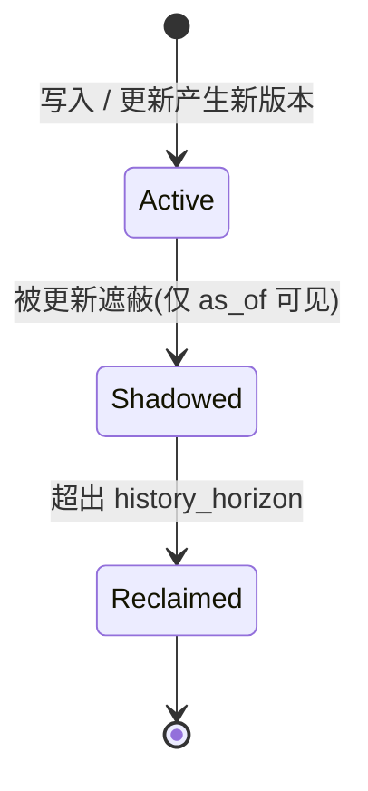

# 09 记忆模型层:关系、双时态、来源与沉淀

> **本章目标**:把 Mneme 从"向量存储"提升为"记忆引擎"——记忆之间可以有关联、
> 有时间与信念维度、有来源与可信度,并能把零散经历沉淀为稳定知识。
> **前置阅读**:[03 §2](03-l1-memory.md)(写入/更新语义)、[04 §2.2a](04-l2-persist.md)(delta 与关系持久化)、[07](07-l5-life.md)(遗忘)。
> **本章你将学到**:为什么"记忆 ≠ 向量" → 关联图与联想检索 → 双时态与 `as_of` →
> 来源/可信度 → 记忆沉淀(consolidation) → 层边界契约。
>
> 所有能力默认关闭、零额外成本:不写关系、不用 `as_of`、
> 不开 `Scoring` 时,行为与 [03](03-l1-memory.md) 的纯向量/BM25 完全一致。

模块:`model/{relation.rs, temporal.rs, provenance.rs, consolidate.rs}`

---

## 1. 为什么需要记忆模型

纯向量库能回答"哪条记忆和这个问题语义相近",但 Agent 真正需要的是:

- **联想**:想起"用户换了新工作"时,顺带想起"他之前提过的新公司"——记忆之间需要**边**;
- **时间**:Agent 会更新信念("用户现在用 macOS 了"),需要区分"事务时间"(何时写入)与
  "有效时间"(这条事实在现实中何时成立),并支持"回看某天我知道什么";
- **来源与可信度**:"用户亲口说的"与"模型推测的"不该同等重要;矛盾信息需要可追溯;
- **沉淀**:一周的对话(episodic)应能合并成一条稳定偏好(semantic),而不是永远堆着 200 条碎片。

本章定义这四个维度的引擎级语义。它们不是应用层 hack,而是与段、索引、compaction
同生命周期的一等公民。

---

## 2. 记忆关系(关联图)

### 2.1 【直觉】知识是图,不是一堆卡片

人脑的记忆是**联想网络**:提到一个概念会激活相关概念。Mneme 把这种关联显式化为有向带权边:

```text
(preference: "用户喜欢深色模式") ──SUPPORTS──► (decision: "UI 默认深色主题")
(fact: "用户用 macOS")           ──CONTRADICTS─► (fact: "用户用 Windows")
(summary: "用户的前端偏好")       ──DERIVED_FROM─► (preference: "喜欢深色模式")
```

### 2.2 类型与 API

```rust
pub struct RelationKind(pub u16);          // 内置占用 0..=15(当前 0..=3),自定义从 16 起
impl RelationKind {
    pub const DERIVED_FROM: Self;          // =0 派生自(摘要→来源)
    pub const SUPPORTS: Self;              // =1 支持
    pub const CONTRADICTS: Self;           // =2 矛盾
    pub const RELATED: Self;               // =3 弱相关
    pub fn custom(name: &str) -> Result<Self>;  // 名称→稳定编号(≥16;已注册则返回既有编号)
}
pub struct Edge { pub from: RowId, pub to: RowId, pub kind: RelationKind, pub weight: f32, pub metadata: Meta }

ns.relate(from, to, kind, weight)?;        // 幂等:同 (from,to,kind) 覆盖 weight(metadata 不变)
ns.relate_with_options(
    from, to,
    RelateOptions::new(kind, weight).metadata(meta),
)?;                                        // 幂等:同时覆盖 weight 与 metadata
ns.unrelate(from, to, kind)?;              // 返回是否命中
let edges: Vec<Edge> = ns.neighbors(from, &[RelationKind::SUPPORTS])?;       // 出边
let in_edges: Vec<Edge> = ns.predecessors(to, &[RelationKind::SUPPORTS])?;  // 入边(见 §2.3)
```

- 关系边以 `(from, to, kind)` 为唯一键,重复 `relate` 为 upsert;
- 边可携带 `weight ∈ [0,1]`(影响联想扩展的传播强度,[10 §3](10-scoring.md))与任意 metadata;
- **自定义关系**的 `custom(name)` 经名称注册表映射为稳定 u16:内置固定占用 `0..=3`,
  `4..=15` 预留给未来内置类型,自定义从 **16** 起分配;同一名称全局唯一,编号空间耗尽
  (约 65520 个自定义类型)时返回 `TooLarge`。注册经 WAL
  `RelKindRegister` 帧落盘([04 §2.3](04-l2-persist.md)),并由 MANIFEST 的关系类型注册表
  持久化(`RelKindEntry` + `next_rel_kind` 水位,[04 §2.4](04-l2-persist.md)),
  不同进程/重启后编号一致(与 `NsRegister` 同一恢复机制,[04 §3.3](04-l2-persist.md))。

### 2.3 存储与一致性

| 形态 | 位置 |
|---|---|
| 内存增量 | `WriterState.relations`([03 §3](03-l1-memory.md)) |
| 持久化 | 全量快照段的 relations 区([04 §2.2b](04-l2-persist.md),仅正向表;反向边恢复时在内存重建);变更经 WAL `Relate`/`Unrelate` 帧(delta 区属 L5,L2 恒空) |
| 可见性 | 任一端被删除 → 边视为悬挂、不返回;compaction 物理清除 |

- **不变量 I25**:`neighbors` 只返回两端都活着的边;删除/遗忘一端后,边**立即**在视图上失效
  (无需等 compaction);compaction 后物理清除;
- **复杂度**:出边 `neighbors(from)` = `O(log E + degree)`(relations 区按 from 排序);
  入边 `predecessors(to)` 默认走全段扫描(按 from 排序的区无法按 to 二分),需要高频入边时显式
  `Builder::relation_index(RelationIndex::Both)`(空间 ×2)启用按 `(to, kind, from)` 排序的反向索引,
  此时同样 `O(log E + degree)`;默认 `Outgoing`(`predecessors` 仍可用,只是较慢);
- 边**不参与向量打分**,只作为 [10 §3](10-scoring.md) 的扩展算子。

### 2.4 【算例】联想扩展

```text
命中 A("用户喜欢深色模式", sim=0.91)
neighbors(A, [SUPPORTS, RELATED]) → B(weight 0.8), C(weight 0.5)
扩展分: B = 0.91 × 0.8 × decay^1, C = 0.91 × 0.5 × decay^1   (decay 默认 0.5/跳)
最终结果按 [10 §2](10-scoring.md) 的综合分排序,B/C 即使向量相似度略低也可能进入 top-k
```

---

## 3. 双时态:有效时间与事务时间

### 3.1 【直觉】"他什么时候是程序员"和"我什么时候知道"

一条记忆有两个时间轴:

- **事务时间(transaction time)**:这条记录何时被写进库、何时被更新(引擎自动维护,
  即 `created_at` 与 seqno);
- **有效时间(valid time)**:这条事实在现实世界中何时成立(`valid_from` ~ `valid_to`,
  由调用方给出)。

例:用户 2024-01 用 Windows,2024-06 换 macOS。两条 `fact` 记忆有效时间不重叠;
事务时间都是"我什么时候听说的"。`as_of(2024-03)` 应该只看到 Windows 那条。

### 3.2 语义

```rust
Record::new(v).key("os").valid_from(ts("2024-06-01")).metadata(json!({"os":"macos"}))
// valid_to 缺省 = 至今有效(开区间)

let old = db.as_of(ts("2024-03-01"))?;   // 历史视图
old.namespace("agent-42/profile").get("os")?;   // → Windows
```

- `as_of(t)` 返回一个 `SnapshotHandle`(**不变量 I26**):只包含**事务时间 ≤ t** 的版本,
  且每条 RowId 取该时刻的最新可见版本;其内容不随后续写入或 compaction 变化(时间旅行读)。
  底层由**版本链**支撑:compaction 按 `CompactionPolicy.history_horizon` 保留历史版本
  (默认 `None` = **永久**,[07 §4.2a](07-l5-life.md));仅当显式设置有限 horizon 时,
  超出窗口的历史才不可回溯;
- `as_of` 与 `Scoring::recency` 使用不同的时间轴:前者是事务时间过滤,后者默认用有效时间
  ([10 §2](10-scoring.md)),二者正交;
- **`valid_time` 只影响查询过滤与打分,不触发物理删除**:一条"已过期"的有效时间记忆
  仍可被历史查询召回;需要真正遗忘时用 TTL/`forget`。

### 3.3 信念修订(supersede)

```rust
ns.supersede(key, new_record)?;   // 语义糖:update 同 key + 将旧版本 valid_to = 新版本 valid_from
```

`supersede` 把"更新"与"有效时间闭区间"绑定:旧事实在有效时间上被新事实取代,但**历史版本被
保留**(默认永久,受 `history_horizon` 约束,[07 §4.2a](07-l5-life.md))。这与普通 `update`
(整体替换、旧版本仅被遮蔽)的区别是:`supersede` 保留"曾经为真"的语义,且历史经版本链可查。
由于是 `update 同 key`,新记录**沿用目标 key**:`new_record` 省略 key 时继承首参 `key`;
显式给出且冲突 → `KeyMismatch`,绝不静默改 key 或留下悬挂 `key_index`。已墓碑记录与
`update` 同口径返回 `NotFound`——墓碑不因 `supersede` 复活([FC-MODEL-POST-003](../spec/contracts.md))。

### 3.4 矛盾与一致

- `RelationKind::CONTRADICTS` 只是标注,引擎**不自动裁决**谁对;排序时由 [10 §2](10-scoring.md)
  的 `confidence` 与 `recency` 决定倾向,最终由宿主/Agent 决策;
- `db.check()` 在 L1 校验 key 索引 ↔ 最新物理版本对账:索引指向不存在的版本,或最新版本
  `ns_id`/`key` 与索引不符才报告不一致,墓碑/逻辑过期记录不算不一致
  ([FC-MEM-POST-008](../spec/contracts.md));L2 起扩展为段 CRC、RowId 版本链一致性、
  「同 key 有效时间重叠的活版本」等全量校验与建议;建议不阻断;
- **版本状态(STA 契约用语,对应 [FC-MODEL-STA-001](../spec/contracts.md))**:同一 RowId 的物理版本
  从 `Active`(seqno 最大、当前查询可见)变为 `Shadowed`(被更新遮蔽、当前查询不可见,
  但仍可经 `as_of` 历史读),再在超出 `history_horizon` 后变为 `Reclaimed`(物理回收、彻底不可见)。
  `supersede` 只把旧版本置为 `Shadowed` 并闭合 `valid_to`,不改变该状态机。



---

## 4. 来源与可信度(provenance & confidence)

### 4.1 字段

| 字段 | 类型 | 语义 |
|---|---|---|
| `confidence` | `f32 ∈ [0,1]` | 该记忆为真的可信度,默认 1.0,越界钳制到 [0,1];参与排序([10 §2](10-scoring.md)) |
| `provenance` | `Meta` | 来源/派生链,开放 JSON(如 `{"source":"user","session":"s88","derived_from":[123]}`) |

- `provenance` 是开放结构,引擎只在 **consolidation** 时自动写入 `derived_from`;
- `confidence` 与 `importance` 正交:前者是"我有多确信",后者是"它对我多重要";
- 检索可用保留字段过滤:`confidence > 0.7`([16 §8.1](16-api-reference.md))。

### 4.2 复杂度

两字段随记录体存储([04 §2.2](04-l2-persist.md)),每条约 4B + JSON;不参与索引构建,
仅在打分/过滤时读取。`confidence` 进 zone map,支持块级剪枝。

---

## 5. 记忆沉淀(consolidation)

### 5.1 【直觉】把一周的流水账变成一条结论

Agent 每天产生大量 episodic 记忆("今天用户问了三件事")。时间久了,库被碎片淹没。
**沉淀** = 在某个范围内找出近似重复/相关的记忆,聚成一簇,合并或摘要成一条 semantic 记忆,
并用 `DERIVED_FROM` 边指向来源。这与人脑"睡眠中整理记忆"的过程对应。

### 5.2 算法

```text
consolidate(policy):
  1. 取候选 = iter(policy.filter)(默认全库活记录)
  2. 聚类:以向量相似度 ≥ policy.threshold 为边做连通分量(union-find);
     单簇大小 > policy.max_cluster 时按 importance 保留前 max_cluster 条,其余暂不沉淀
  3. 每簇:
     a. summarizer 提供 → 调用宿主摘要器得到新 Record;否则引擎拼接
        (取最高 importance 的向量 + 拼接去重后的 text + 合并 metadata)
     b. 写入摘要记录(写入 `policy.target` 指定的命名空间,缺省 = 调用 `consolidate` 的
        当前命名空间),confidence = 簇内加权平均,importance = max(簇内)
     c. 建立 DERIVED_FROM 边(摘要 → 每个来源)
     d. keep_sources=true 时保留来源(只加边);false 时对来源打墓碑(逻辑删除)
  4. 返回 ConsolidateReport{ clusters, merged, created }
```

- **摘要向量**:若宿主提供 `Summarizer`,由宿主决定向量(通常再嵌入一次摘要文本);
  引擎不内置嵌入模型([16 §6](16-api-reference.md));
- **幂等**:同一 policy 重复执行,已沉淀的簇(来源已墓碑或已有 `DERIVED_FROM` 边)跳过;
- **安全**:`keep_sources=true` 为默认,沉淀**不删除**原始记忆;要物理收敛需显式关闭;
- **复杂度**:聚类是近邻图的连通分量。朴素实现 $O(N \cdot ef \cdot M_0 \cdot d)$(每点查
  top-m 邻居);`policy.filter` 缩小范围可显著降本。沉淀在后台线程执行,受 compaction
  同一 IO 预算限速([07 §4.4](07-l5-life.md))。

### 5.3 【算例】

```text
5 条记忆阈值 0.95:
  m1 "用户喜欢深色模式" imp=0.8
  m2 "用户偏好暗色主题" imp=0.6   (与 m1 sim=0.97)
  m3 "用户喜欢浅色模式" imp=0.9   (与 m1 sim=0.3 → 独立簇)
  m4 "用户界面偏好深色" imp=0.5   (与 m1 sim=0.96)
  m5 "用户用 macOS"     imp=0.7   (独立簇)
连通分量:{m1,m2,m4}, {m3}, {m5}
摘要 S = summarize(m1,m2,m4) → 向量取 m1,text 合并,importance=0.8,confidence=avg
DERIVED_FROM: S→m1, S→m2, S→m4
报告:clusters=1(仅 ≥2 的簇计入), merged=3, created=[S]
```

---

## 6. 层边界契约(产品能力层 → 上层)

**向上提供**:

1. 关系:类型注册表、`relate/relate_with_options/unrelate/neighbors/predecessors`、联想扩展的数据源(不变量 I25);
2. 双时态:`valid_from/valid_to`、`as_of(ts)`、`supersede`(不变量 I26);
3. 来源/可信度:`confidence`/`provenance` 字段与过滤;
4. 沉淀:`consolidate(policy)` 与 `ConsolidateReport`。

**依赖**:L0(类型)、L2(relations 持久化)、L3(近邻查询用于聚类)、L4(计划器用于 filter)、L5(compaction/tombstone;delta 覆盖区)。

**不变量**:I22(稳定 RowId)、I24(更新原子可见)、I25(关系一致)、I26(双时态一致;历史默认永久保留,受 `history_horizon` 约束)。

## 本章小结

- 记忆 ≠ 向量:关系图、双时态、来源/可信度、沉淀是引擎级一等公民。
- `relate` 以 `(from,to,kind)` 幂等;悬挂边不可见(I25);自定义关系类型有稳定注册表。
- 双时态 = 事务时间 + 有效时间;`as_of` 时间旅行、`supersede` 信念修订(I26)。
- 版本状态:`Active → Shadowed → Reclaimed`,默认永久保留。
- `consolidate` 聚类→摘要→`DERIVED_FROM`,默认不删除来源。
- **本章不变量**:I22、I24、I25、I26。

## 下一章

[10-scoring.md](10-scoring.md):让检索真正"像记忆一样"——时序、重要度、访问与联想共同参与排序。
