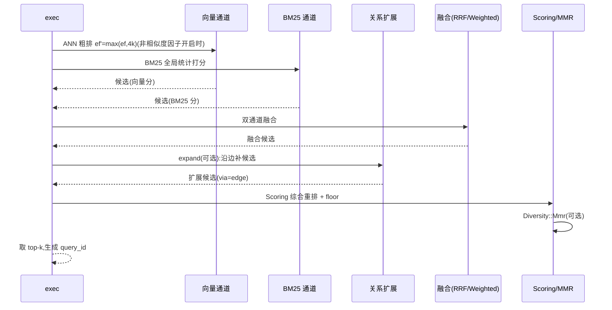

# 10 检索排序层:让检索像记忆一样工作

> **本章目标**:把 Mneme 独有的记忆信号(时间、重要度、访问、可信度、关联)真正用进检索排序,
> 并保证"默认行为不变、开启后可解释、可回退"。
> **前置阅读**:[03 §2.2](03-l1-memory.md)(检索语义)、[06](06-l4-query.md)(融合管线)、[07 §2–§3](07-l5-life.md)(访问与遗忘)、[09](09-memory-model.md)(关系/双时态)。
> **本章你将学到**:为什么纯相似度不够 → 综合打分公式与归一化 → 在 HNSW 上如何不破坏召回 →
> 联想扩展 → 反馈闭环 → MMR 多样性 → 与融合管线的整合。
>
> `Scoring`/`Diversity`/`expand` 默认关闭,不改变默认行为。

模块(`memory/` 下):`score/`(综合打分公式与归一化)、`expand.rs`(联想扩展)、
`rerank.rs`(MMR 多样性/去重/精排钩子);`Feedback` 闭环经 `namespace` 写路径落地。

---

## 1. 为什么默认排序不够

纯向量/BM25 检索回答的是"哪条**最像**",但 Agent 记忆的正确问题常常是:

- "我最该想起哪条?"——一条三年前高度相似但已过时的偏好,不该压过昨天刚确认的事实;
- "哪条对我最重要?"——`importance=0.9` 的核心决策 vs `importance=0.1` 的临时笔记;
- "哪条我最常用?"——高频被引用的记忆更可能是稳定知识;
- "哪条更可信?"——用户亲口说的 vs 模型推测的;
- "还有哪些**相关**?"——沿关系边联想到的记忆,即使字面不相似。

这些信号引擎**已经持有**(`created_at`/`valid_from`/`importance`/`access_count`/`confidence`/关系边),
旧设计却完全没用进排序。本章把它们统一为可配置打分。

---

## 2. 综合打分:`Scoring`

### 2.1 公式

对候选记录 $d$ 与查询 $q$:

$$
S(d) \;=\; \underbrace{w_{\text{sim}}\,\hat{s}(d)}_{\text{similarity}}
\;+\; \underbrace{w_{\text{rec}}\,\text{rec}(d)}_{\text{recency}}
\;+\; \underbrace{w_{\text{imp}}\,\text{imp}(d)}_{\text{importance}}
\;+\; \underbrace{w_{\text{acc}}\,\text{acc}(d)}_{\text{access}}
\;+\; \underbrace{w_{\text{conf}}\,c(d)}_{\text{confidence}}
$$

| 因子 | 定义 | 说明 |
|---|---|---|
| $\hat{s}(d)$ | 相似度归一化到 $[0,1]$ | 用 `Metric::better` 的序,见 §2.2 |
| $\text{rec}(d)$ | $2^{-t/T_{1/2}}$, $t$ = `now - max(valid_from, last_access)` | 与遗忘曲线同源([07 §3.2](07-l5-life.md));默认用**有效时间**,`Scoring::time_axis` 可切换事务时间 |
| $\text{imp}(d)$ | `importance`(已在 $[0,1]$) | [03 §2.1](03-l1-memory.md) |
| $\text{acc}(d)$ | $\ln(1+c)/\ln(1+c_{\text{norm}})$ 截断到 $[0,1]$ | 边际递减,与 [07 §3.3](07-l5-life.md) 一致;$c_{\text{norm}}$ 默认 100 |
| $c(d)$ | `confidence` | [09 §4](09-memory-model.md) |

### 2.2 相似度归一化

不同度量的原始分不可比($\cos \in [-1,1]$、点积无界、欧氏为距离平方且**越小越优**)。
先按 `Metric::better` 的方向把原始分统一成"越大越优"的 $s^{*}$(点积/余弦 $s^{*}=s$;
欧氏 $s^{*}=-s$),再在**候选集内**归一化:

$$
\hat{s}(d) = \mathrm{clamp}\!\left(\frac{s^{*}(d) - s^{*}_{\min}}{s^{*}_{\max} - s^{*}_{\min}},\ 0,\ 1\right)
$$

- 候选集 = 各通道 top-$m$($m$ 见 §2.3),不是全库;这与 [06 §4.2](06-l4-query.md) 的加权融合同源;
- **方向**:直接对欧氏的 `s`(距离平方)套用上式会把最远者归一为 1,故必须先定向为 $s^{*}=-s$;
- `s^{*}_{\max} = s^{*}_{\min}` 时 $\hat{s} \equiv 1$;
- **`Scoring::floor`**:若 $\hat{s}(d) < \text{floor}$,则 $S(d)$ 直接置 0——防止"低相似但高重要度"的
  记录被时序因子顶进 top-k(默认 `floor=0`,即不设限);
- **纯 BM25 查询**(只调 `.text()`、无向量通道):没有相似度可言,$\hat{s}(d)$ 取 0,
  综合分退化为其余因子;需要"关键词为主"时用 `Fusion::Weighted { alpha: 0.0 }`
  或直接采用 BM25 排名,不要依赖 `w_sim`。

### 2.3 在 HNSW 上如何不破坏召回

时序/重要度/访问/可信度**与向量距离不相关**,因此不能简单地用综合分做 ANN 剪枝
(会破坏 HNSW 的单调性保证,召回崩塌)。正确做法是**两段式**:

```text
① ANN 粗排:用原始相似度跑 HNSW,取 ef' = max(ef, 4k) 的候选;
② 综合重排:对候选集计算 S(d),取 top-k。
```

> **实现口径**:① 候选放大 `ef' = max(ef, 4k)` 在 `Scoring` 开启任一非相似度因子时
> 对向量通道生效(`FC-SCORE-POST-003`,相对暴力综合排序召回损失 ≤ 2%);
> `Scoring::bias_routing = true` 按下方启发式改变 HNSW 前沿出堆顺序,只影响访问顺序、
> 不改最终打分(`FC-SCORE-POST-007`);② 综合重排在候选集上完成。
> 默认 `Scoring`(仅相似度)不放大,排序与未开启时全等(`FC-SCORE-POST-001`)。

- 放大 $ef$ 是为了让"向量相似度略低、但综合分高"的记忆进入候选池:经验上
  `ef' = max(ef, 4k)` 时综合排序的相对召回损失 ≤ 2%(门槛见 [14 §4](14-testing.md));
- **可选的重要性偏置路由**(`Scoring::bias_routing=true`):HNSW 遍历时以前沿
  优先级 `priority = close_key(score) + β·(imp + min(acc/c_norm, 1))` 出堆(β 为实现内部
  固定系数 1.0;仅改候选访问顺序,不改最终打分与 `ef→∞` 结果)。它能在保持召回的同时
  减少探查量;默认关闭(`FC-SCORE-POST-007`);
- **可解释性**:`Hit` 可经 `Hit::explain()` 返回各因子贡献(调试/审计用,不影响主路径)。

### 2.4 【算例】

$w_{\text{sim}}=1, w_{\text{rec}}=0.3, w_{\text{imp}}=0.2$,半衰期 14d:

```text
候选 A: ŝ=0.90, 3 天前有效 → rec=2^(-3/14)=0.862, imp=0.3 → S=0.90+0.259+0.06=1.219
候选 B: ŝ=0.95, 3 年前有效 → rec≈2^(-1095/14)≈0.000, imp=0.1 → S=0.95+0.000+0.02=0.970
→ A 胜出(旧但高度相似不再自动压过新信息)
```

### 2.5 复杂度

| 阶段 | 时间 | 说明 |
|---|---|---|
| ANN 粗排 | 同 [05 §6.1](05-l3-hnsw.md),`ef' = max(ef,4k)`(非相似度因子开启时,`FC-SCORE-POST-003`) | 约 4× 候选 |
| 综合重排 | $O(m)$(m = 候选数) | 每候选常数次浮点运算 |
| 归一化 | $O(m)$ | 单遍求 min/max |
| 排序 | $O(m\log m)$ | 按综合分稳定排序(同分按 `RowId` 升序) |

合计 $O(m\log m)$(契约 `FC-SCORE-CPLX-001`)。

`Scoring::default()` 各时序权重为 0,退化为纯相似度,零额外开销。

---

## 3. 联想扩展:`RelationExpand`

### 3.1 【直觉】扩散激活

命中一条记忆后,沿它的关系边"激活"相关记忆。传播强度随跳数与边权衰减:

$$
\text{boost}(v) = \max_{p \in \text{paths}(q \to v)} \left( \hat{s}(\text{seed}_p) \cdot \prod_{e \in p} \text{weight}(e) \cdot \text{decay}^{\,|p|} \right)
$$

- `hops` 默认 1(只扩展一跳),最大 3;
- `decay` 默认 0.5/跳,`max_nodes` 限制扩展节点数以封顶延迟;
- 扩展命中的 `Hit.via = Some(edge)`,调用方可解释来源;
- 扩展分按**多路径取最大**传播(`best(v) = max(种子分, max_p boost(p))`),与既有
  通道候选按 `RowId` 合并、分数取 `max(自身分, boost)`(绝不重复出现,`FC-SCORE-POST-006`);
  未开启 `Scoring` 时被提升/引入的候选与向量候选一起排序;开启 `Scoring` 后参与归一与
  综合排序;`via` 只在扩展确有贡献时记录;

### 3.2 复杂度

扩展 = 从每个种子做有界 BFS:$O(\text{seeds} \cdot \text{max\_nodes} \cdot \text{avg\_degree})$;
`visited` 集合**总量**受 `max_nodes` 封顶(空间 $O(\text{max\_nodes}+\text{seeds})$——
种子预置其中、结果为其子集,被命名空间/存活/过滤拒绝的节点也计入,达到上限会提前停止扩展),
`max_nodes` 默认 `4096`(可配),与段数无关;关系邻接定位见 [09 §2.3](09-memory-model.md)。

### 3.3 边界

- 只沿**活边**扩展(两端存活,I25);遇墓碑节点不传播;
- 扩展**不引入跨命名空间**的记忆(命名空间隔离优先;契约 `FC-SCORE-POST-004`);
- 扩展结果同样受 filter 约束(过滤先行,[06 §2](06-l4-query.md))。

---

## 4. 反馈闭环:`Feedback`

### 4.1 【直觉】被用到的记忆更值得记住

`touch` 需要宿主显式调用。更好的做法是:检索返回时带上 `query_id`,`execute()` 之后
宿主告知"这条被用到了",引擎自动强化:

```rust
let hits = ns.search().vector(&q).top_k(10).execute()?;
for h in &hits { /* Agent 使用 h */ }
ns.feedback(hits[0].rowid, Feedback::Used, hits[0].query_id)?;      // 访问 +1,importance 微增
ns.feedback(hits[3].rowid, Feedback::Ignored, hits[3].query_id)?;   // 访问 +0,importance 微减(可选)
ns.feedback(hits[2].rowid, Feedback::Corrected { by: corrected_id }, hits[2].query_id)?;  // 建立 CONTRADICTS/修正边
```

### 4.2 语义

| 反馈 | 效果 |
|---|---|
| `Used` | `access_count += 1`、`last_access = now`、`importance += δ_up`(默认 +0.02,clamp) |
| `Ignored` | 仅记录负样本;`importance -= δ_down`(默认 0,即默认不惩罚) |
| `Corrected { by }` | 建立 `by → CONTRADICTS → this` 边,并降低本记录 `confidence` |

- **幂等(I27)**:反馈以 `(rowid, query_id)` 为幂等键,重复提交至多计一次;
  `query_id` 由 `execute()` 隐式生成,也可 `SearchBuilder::query_id(...)` 指定;
- 反馈先入内存累积区,随 [07 §2](07-l5-life.md) 的批量机制落 WAL delta;
- 关闭反馈时零成本。

---

## 5. 多样性:`Diversity::Mmr`

### 5.1 【直觉】别返回 10 条一模一样的记忆

近似去重([06 §6](06-l4-query.md))只能去掉"几乎相同"的;MMR(最大边际相关性)
让结果**相关且互相不同**:

$$
\text{MMR} = \arg\max_{d \in C \setminus R}\Big[\lambda \cdot \text{rel}(d) - (1-\lambda)\cdot \max_{r \in R}\text{sim}(d, r)\Big]
$$

- `λ ∈ [0,1]`,设计推荐 0.7(偏相关),须显式构造(`Diversity::default()` 为 `Off`);`λ=1` 等价于不启用;
- `rel(d)` 用 [§2](#2-综合打分scoring) 的综合分;`sim(d,r)` 用向量相似度;
- 贪心实现的时间为 $O(m\cdot k\cdot d)$($m$ = 候选数、$k$ = 返回条数):维护各候选与
  已选集的**最大余弦** `max_sim`,每选中一条只对剩余候选各算一次对级余弦并增量取最大
  (每个候选-已选对至多计算一次,自范数预计算复用);空间 $O(m)$(`max_sim` + 范数表)。
  契约见 FC-SCORE-CPLX-003,操作计数单测
  `src/memory/score/::mmr_caches_pairwise_similarity`;$k$ 通常 ≤ 50。

### 5.2 与去重的关系

`ResultDedup::Near` 先按阈值剔除近似重复,`Diversity::Mmr` 再在剩余候选里保证多样性;
两者可同时开启,顺序固定为先去重后多样。

---

## 6. 与融合管线的整合



- **顺序固定**:过滤 → 双通道 → 融合 → 关系扩展 → 综合打分 → 去重/多样性 → 重排钩子;
- 每步都可关闭,关闭后等价旧管线([06 §5](06-l4-query.md));
- `query_id` 在管线开始时生成,随 `Hit` 返回的 `execute()` 结果集一起交给反馈([§4](#4-反馈闭环feedback))。

---

## 7. 层边界契约(产品能力层 → 上层)

**向上提供**:

1. `Scoring` 综合打分(相似度/新鲜度/重要度/访问/可信度),默认全权重关闭;
2. `RelationExpand` 联想扩展;`Diversity::Mmr` 多样性;
3. `Feedback` 闭环与 `(rowid, query_id)` 幂等;
4. `Hit.via` 与 `Hit::explain()` 的可解释性输出。

**依赖**:L0(度量/类型)、L3(ANN 候选)、L4(过滤/融合)、L5(访问统计)、[09](09-memory-model.md)(关系/时态/可信度)。

**不变量**:I25(关系一致)、I26(双时态一致)、I27(反馈幂等);召回门槛见 [14 §4](14-testing.md)。

## 本章小结

- 纯相似度不够:新鲜度/重要度/访问/可信度/联想统一进综合打分。
- 综合分在**候选集内**归一化;`floor` 防止低相似记录被时序因子顶进 top-k。
- HNSW 上用"ANN 粗排 + 综合重排"两段式避免破坏召回;可选重要性偏置路由。
- 联想扩展、反馈闭环(I27)、MMR 多样性;顺序固定,默认全部关闭。

## 下一章

[11-security-storage.md](11-security-storage.md):静态加密与压缩,补齐产品化的存储安全与体积控制。
